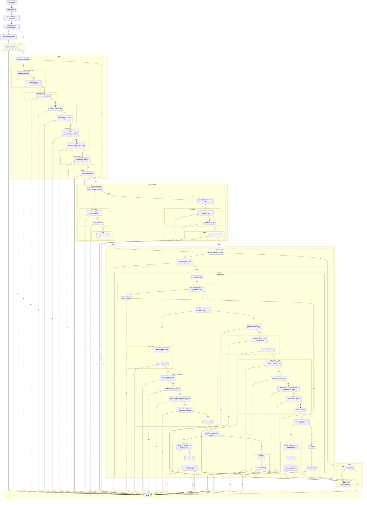

# mariadb-galera
Docker image and Helm chart to deploy a [MariaDB](https://mariadb.com/kb/en/getting-installing-and-upgrading-mariadb/) HA cluster based on [Galera](https://mariadb.com/kb/en/what-is-mariadb-galera-cluster/)

## additional documentation
* [MariaDB server system variables](https://mariadb.com/kb/en/server-system-variables/)
* [mysql_install_db parameters](https://mariadb.com/kb/en/mysql_install_db/)
* [MariaDB install packages](https://mariadb.org/download/?t=repo-config&d=20.04+%22focal%22&v=10.5&r_m=hs-esslingen)
* [MariaDB automation](https://mariadb.com/kb/en/automated-mariadb-deployment-and-administration/)
* [Galera cluster description](https://mariadb.com/kb/en/what-is-mariadb-galera-cluster/)
* [Galera getting started](https://mariadb.com/kb/en/getting-started-with-mariadb-galera-cluster/)
* [Galera monitoring](https://galeracluster.com/library/documentation/monitoring-cluster.html)
* [Galera Crash recovery](https://galeracluster.com/library/documentation/crash-recovery.html)
* [Primary recovery after clean shutdown of the cluster](https://galeracluster.com/library/documentation/pc-recovery.html)
* [calculate the Galera Cache Size for IST(Incremental State Transfer)](https://galeracluster.com/library/kb/customizing-gcache-size.html)
* [custom pc.weight for predictable quorum decisions](https://galeracluster.com/library/documentation/weighted-quorum.html#wq-three-nodes)
* [check Galera replication health](https://galeracluster.com/library/documentation/monitoring-cluster.html#check-replication-health)
  * `wsrep_local_recv_que_avg` should be 0 (indicates if the local cluster node is not fast enough to apply the changes)
  * `wsrep_flow_control_paused` should be 0 (0.25 means 25% of the time replication was paused)
  * `wsrep_cert_deps_distance` difference between lowest and highest sequence number in the cluster
* [Setting Parallel Slave Threads for replication](https://galeracluster.com/library/kb/parallel-applier-threads.html)
* [Unit Testing for Prometheus exporters](https://www.prometheus.io/docs/prometheus/latest/configuration/unit_testing_rules/)

## MariaDB Galera flow charts
During their lifecycle several decisions have to be made for the database nodes (running in containers) before actually starting the MariaDB process. Some decicions even have to be made during the runtime of the process.
### node startup

## Docker image

### build the image

| build argument | description |
|:--------------|:-------------|
| BASE_REGISTRY | hostname of the image registry |
| BASE_ACCOUNT  | account/project used in the registry |
| BASE_SOFT_NAME  | name of the software that will be used as base image |
| BASE_SOFT_VERSION  | version of the software for the base image |
| BASE_IMG_VERSION  | version of the base image |
| SOFT_NAME  | name of the software that will be packaged into the image |
| SOFT_VERSION  | version of the software that will be packaged into the image |
| IMG_VERSION  | version of the image that will be build |
| GALERA_VERSION  | Galera software version that should be packaged into the image |
| GALERA_DEBUG  | install Galera debug packages |
| YQ_VERSION | install this [yq version](https://github.com/mikefarah/yq/releases) |

```bash
docker build --build-arg BASE_REGISTRY=keppel.eu-nl-1.cloud.sap --build-arg BASE_ACCOUNT=octobus --build-arg BASE_SOFT_NAME=ubuntu --build-arg BASE_SOFT_VERSION=20.04 --build-arg BASE_IMG_VERSION=0.3.67 --build-arg SOFT_NAME=mariadb --build-arg SOFT_VERSION=10.5.17+maria~ubu2004 --build-arg IMG_VERSION=0.1.2 --build-arg GALERA_VERSION=26.4.12-focal --build-arg YQ_VERSION=4.27.5 -t keppel.eu-de-1.cloud.sap/ccloud/mariadb-galera:10.5.17-0.1.2 -f docker/mariadb-galera/Dockerfile ./docker/mariadb-galera/
```

#### debug build

```bash
docker build --build-arg BASE_REGISTRY=keppel.eu-nl-1.cloud.sap --build-arg BASE_ACCOUNT=octobus --build-arg BASE_SOFT_NAME=ubuntu --build-arg BASE_SOFT_VERSION=20.04 --build-arg BASE_IMG_VERSION=0.3.67 --build-arg SOFT_NAME=mariadb --build-arg SOFT_VERSION=10.5.17+maria~ubu2004 --build-arg IMG_VERSION=0.1.2 --build-arg GALERA_VERSION=26.4.12-focal --build-arg YQ_VERSION=4.27.5 --build-arg GALERA_DEBUG=true -t keppel.eu-de-1.cloud.sap/ccloud/mariadb-galera-debug:10.5.17-0.1.2 -f docker/mariadb-galera/Dockerfile ./docker/mariadb-galera/
```
#### MySQL Exporter image
| build argument | description |
|:--------------|:-------------|
| USERID | id of the user that should run the binary |

```bash
docker build --build-arg BASE_REGISTRY=keppel.eu-nl-1.cloud.sap --build-arg BASE_ACCOUNT=octobus --build-arg BASE_SOFT_NAME=ubuntu --build-arg BASE_SOFT_VERSION=20.04 --build-arg BASE_IMG_VERSION=0.3.67 --build-arg SOFT_NAME=mysqld_exporter --build-arg SOFT_VERSION=0.14.0 --build-arg IMG_VERSION=0.1.1 --build-arg USERID=3000 -t keppel.eu-de-1.cloud.sap/ccloud/mysqld_exporter:0.14.0-0.1.1 -f docker/mysqld_exporter/Dockerfile ./docker/mysqld_exporter/
```
#### ProxySQL image
| build argument | description |
|:--------------|:-------------|
| USERID | id of the user that should run the binary |

```bash
docker build --build-arg BASE_REGISTRY=keppel.eu-nl-1.cloud.sap --build-arg BASE_ACCOUNT=octobus --build-arg BASE_SOFT_NAME=ubuntu --build-arg BASE_SOFT_VERSION=20.04 --build-arg BASE_IMG_VERSION=0.3.67 --build-arg SOFT_NAME=proxysql --build-arg SOFT_VERSION=2.4.3 --build-arg IMG_VERSION=0.1.1 --build-arg USERID=3100 -t keppel.eu-de-1.cloud.sap/ccloud/proxysql:2.4.3-0.1.1 -f docker/proxysql/Dockerfile ./docker/proxysql/
```
## Helm chart

### render the chart templates

* `helm template mariadb-galera helm --namespace database`

### deploy the chart

* `helm upgrade --install --create-namespace --namespace database mariadb-galera helm`

### remove the deployed release

* `helm uninstall --namespace database mariadb-galera`
