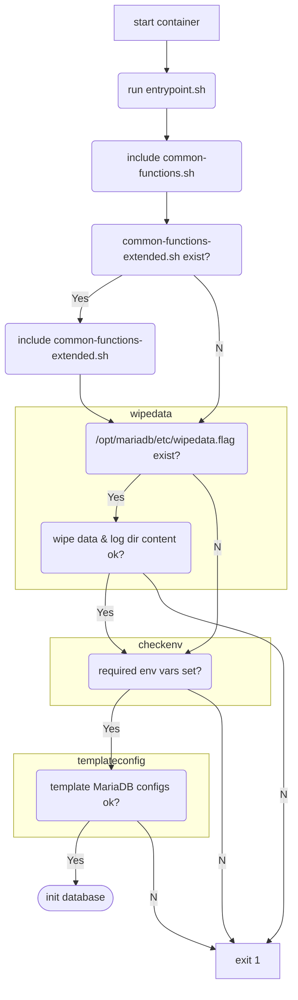
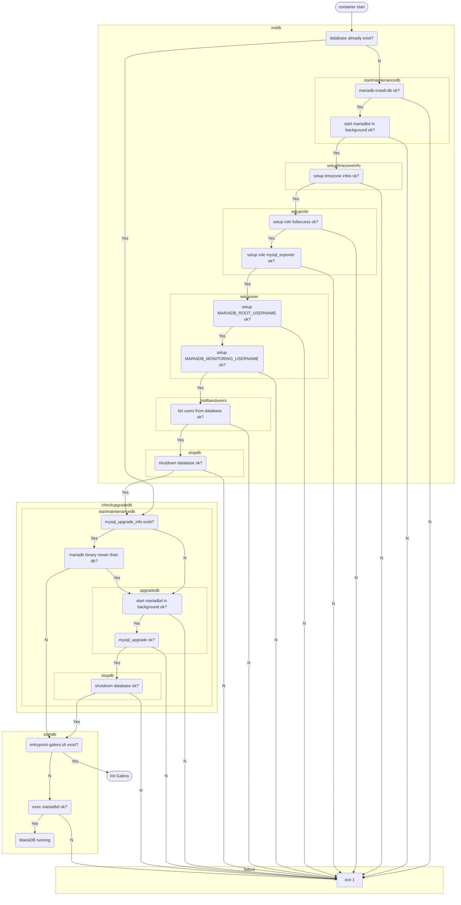
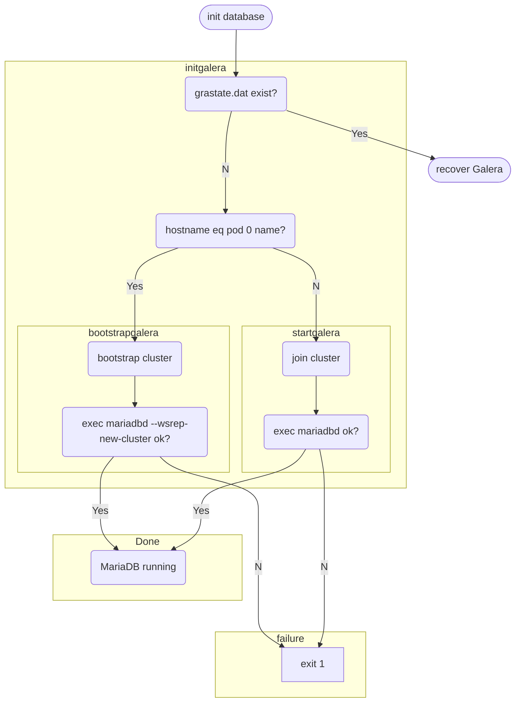
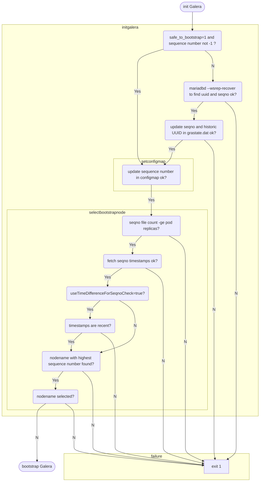

# mariadb-galera

Docker images and Helm chart to deploy a [MariaDB](https://mariadb.com/kb/en/getting-installing-and-upgrading-mariadb/) HA cluster based on [Galera](https://mariadb.com/kb/en/what-is-mariadb-galera-cluster/)

## Table of Contents
* [Metadata](#Metadata)
  * [Changelog](#Changelog)
* [Requirements](#Requirements)
* [Container images](#container-images)
  * [MariaDB Galera image](#mariadb-galera-image)
  * [MySQL Exporter image](#mysql-exporter-image)
  * [ProxySQL image](#proxysql-image)
  * [Kopia image](#kopia-image)
  * [Ubuntu image](#ubuntu-image)
* [Helm chart](#helm-chart)
  * [template](#template)
  * [install](#install)
  * [uninstall](#uninstall)
  * [registry](#registry)
  * [values description](#values-description)
  * [network config](#network-config)
  * [database backup](#database-backup)
    * [S3 backend](#s3-backend)
    * [NFS backend](#nfs-backend)
  * [full database recovery](#full-database-recovery)
  * [point in time database recovery](#point-in-time-database-recovery)
  * [asynchronous replication config](#asynchronous-replication-config)
  * [MariaDB Galera flow charts](#mariadb-galera-flow-charts)
    * [node startup](#node-startup)
      * [container start](#container-start)
      * [init database](#init-database)
      * [init Galera](#init-galera)
      * [recover Galera](#recover-galera)
      * [bootstrap Galera](#bootstrap-galera)
* [additional documentation](#additional-documentation)
  * [Database](#database)
  * [Galera cluster](#galera-cluster)
  * [Primary/Replica replication](#primaryreplica-replication)
  * [Monitoring](#monitoring)
  * [Backup](#backup)

## Metadata
| chart version | app version | type | url |
|:--------------|:-------------|:-------------|:-------------|
| 0.22.0 | 10.5.22 | application | [Git repo](https://github.com/sapcc/helm-charts/tree/mariadb-galera/common/mariadb-galera) |

| Name | Email | Url |
| ---- | ------ | --- |
| Bashar Alkhateeb |  | <https://github.com/bashar-alkhateeb> |
| Birk Bohne |  | <https://github.com/businessbean> |

### Changelog
The [changelog](CHANGELOG.md) contains information about changes in certain versions

## Requirements

Kubernetes: `>=1.18`

## Container images
### MariaDB Galera image
  | build argument | description |
  |:--------------|:-------------|
  | BASE_REGISTRY | hostname of the image registry |
  | BASE_ACCOUNT  | account/project used in the registry |
  | BASE_SOFT_NAME  | name of the software that will be used as base image |
  | BASE_SOFT_VERSION  | version of the software for the base image |
  | BASE_IMG_VERSION  | version of the base image |
  | SOFT_NAME  | name of the software that will be packaged into the image |
  | SOFT_VERSION  | version of the software that will be packaged into the image |
  | IMG_VERSION  | version of the image that will be build |
  | GALERA_VERSION  | Galera software version that should be packaged into the image |
  | GALERA_DEBUG  | install Galera debug packages |
  | YQ_VERSION | install this [yq version](https://github.com/mikefarah/yq/releases) |

* productive version
  ```bash
  docker build --build-arg BASE_REGISTRY=keppel.eu-de-1.cloud.sap --build-arg BASE_ACCOUNT=ccloud --build-arg BASE_SOFT_NAME=mariadb-galera-ubuntu --build-arg BASE_SOFT_VERSION=20.04 --build-arg BASE_IMG_VERSION=20231009043336 --build-arg SOFT_NAME=mariadb --build-arg SOFT_VERSION=10.5.20+maria~ubu2004 --build-arg IMG_VERSION=20231009043336 --build-arg GALERA_VERSION=26.4.14-ubu2004 --build-arg YQ_VERSION=4.33.3 -t keppel.eu-de-1.cloud.sap/ccloud/mariadb-galera:10.5.20-20231009043336 ./docker/mariadb-galera/
  ```
* debug version
  ```bash
  docker build --build-arg BASE_REGISTRY=keppel.eu-de-1.cloud.sap --build-arg BASE_ACCOUNT=ccloud --build-arg BASE_SOFT_NAME=mariadb-galera-ubuntu --build-arg BASE_SOFT_VERSION=20.04 --build-arg BASE_IMG_VERSION=20231009043336 --build-arg SOFT_NAME=mariadb --build-arg SOFT_VERSION=10.5.20+maria~ubu2004 --build-arg IMG_VERSION=20231009043336 --build-arg GALERA_VERSION=26.4.14-ubu2004 --build-arg YQ_VERSION=4.33.3 --build-arg GALERA_DEBUG=true -t keppel.eu-de-1.cloud.sap/ccloud/mariadb-galera-debug:10.5.20-20231009043336 ./docker/mariadb-galera/
  ```

### MySQL Exporter image
| build argument | description |
|:--------------|:-------------|
| USERID | id of the user that should run the binary |

```bash
docker build --build-arg BASE_REGISTRY=keppel.eu-de-1.cloud.sap --build-arg BASE_ACCOUNT=ccloud --build-arg BASE_SOFT_NAME=mariadb-galera-ubuntu --build-arg BASE_SOFT_VERSION=22.04 --build-arg BASE_IMG_VERSION=20231009043336 --build-arg SOFT_NAME=mysqld_exporter --build-arg SOFT_VERSION=0.14.0 --build-arg IMG_VERSION=20231009043336 --build-arg USERID=3000 -t keppel.eu-de-1.cloud.sap/ccloud/mariadb-galera-mysqld_exporter:0.14.0-20231009043336 ./docker/mysqld_exporter/
```

### ProxySQL image
| build argument | description |
|:--------------|:-------------|
| USERID | id of the user that should run the binary |

```bash
docker build --build-arg BASE_REGISTRY=keppel.eu-de-1.cloud.sap --build-arg BASE_ACCOUNT=ccloud --build-arg BASE_SOFT_NAME=mariadb-galera-ubuntu --build-arg BASE_SOFT_VERSION=22.04 --build-arg BASE_IMG_VERSION=20231009043336 --build-arg SOFT_NAME=proxysql --build-arg SOFT_VERSION=2.5.2 --build-arg IMG_VERSION=20231009043336 --build-arg USERID=3100 -t keppel.eu-de-1.cloud.sap/ccloud/mariadb-galera-proxysql:2.5.2-20231009043336 ./docker/proxysql/
```

### Kopia image
| build argument | description |
|:--------------|:-------------|
| MARIADB_VERSION | MariaDB client version that will be packaged into the image |
| USERID | id of the user that should run the binary |

```bash
docker build --build-arg BASE_REGISTRY=keppel.eu-de-1.cloud.sap --build-arg BASE_ACCOUNT=ccloud --build-arg BASE_SOFT_NAME=mariadb-galera --build-arg BASE_SOFT_VERSION=10.5.20 --build-arg BASE_IMG_VERSION=20231009043336 --build-arg SOFT_NAME=kopia --build-arg SOFT_VERSION=0.12.1 --build-arg IMG_VERSION=20231009043336 --build-arg USERID=3200 --build-arg MARIADB_VERSION=10.5.20+maria~ubu2004 -t keppel.eu-de-1.cloud.sap/ccloud/mariadb-galera-kopiabackup:0.12.1-20231009043336 ./docker/kopia/
```

### Ubuntu image

```bash
docker build --build-arg BASE_SOFT_NAME=ubuntu --build-arg BASE_SOFT_VERSION=20.04 --build-arg IMG_VERSION=20231009043336 -t keppel.eu-de-1.cloud.sap/ccloud/mariadb-galera-ubuntu:20.04-20231009043336 ./docker/ubuntu/
docker build --build-arg BASE_SOFT_NAME=ubuntu --build-arg BASE_SOFT_VERSION=22.04 --build-arg IMG_VERSION=20231009043336 -t keppel.eu-de-1.cloud.sap/ccloud/mariadb-galera-ubuntu:22.04-20231009043336 ./docker/ubuntu/
```

## Helm chart
### template
* render the chart templates
  ```shell
  helm template mariadb-galera helm --namespace database
  helm template mariadb-galera helm --namespace database --values helm/custom/eu-de-2.yaml --show-only templates/statefulset-mariadb.yaml
  ```

### install
* deploy the chart using only the default values.yaml:
  ```shell
  helm upgrade --install --create-namespace --namespace database mariadb-galera helm
  ```

* with [additional custom values](https://helm.sh/docs/chart_template_guide/values_files/#helm) for a certain instance:
  ```shell
  helm upgrade --install --create-namespace --namespace database mariadb-galera helm --values helm/custom/eu-de-2.yaml
  ```

### uninstall
* remove the deployed release
  ```shell
  helm uninstall --namespace database mariadb-galera
  ```

### registry
* login to the [OCI registry](https://helm.sh/docs/topics/registries/#login)
  ```shell
  helm registry login keppel.eu-de-1.cloud.sap --username YOUR_USERNAME
  ```
* [package](https://helm.sh/docs/helm/helm_package/#helm-package) the chart
  ```shell
  helm package helm
  ```
* [push](https://helm.sh/docs/topics/registries/#the-push-subcommand) the chart to the registry
  ```shell
  helm push mariadb-galera-0.22.0.tgz oci://keppel.eu-de-1.cloud.sap/ccloud-helm/
  ```

### values description
| Key | Type | Default | Description |
|-----|------|---------|-------------|
| cleanOsCacheAtStartup | bool | `false` | only useful for benchmarking [www.kernel.org drop_caches](https://www.kernel.org/doc/html/latest/admin-guide/sysctl/vm.html?highlight=drop_caches#drop-caches) |
| env.COLLECT_INFO_SCHEMA_INNODB_TABLESPACES.containerType[0] | string | `"monitoring"` |  |
| env.COLLECT_INFO_SCHEMA_INNODB_TABLESPACES.value | string | `"enable"` |  |
| env.GALERA_SST_PASSWORD.containerType | list | `["database","databasecfgjob","proxysql"]` | for which containers this environment variable will be used |
| env.GALERA_SST_PASSWORD.secretKey | string | `"password"` | Name of the key of the predefined Kubernetes secret that contains the `password` for the `MariaDB Galera state snapshot transfer user` |
| env.GALERA_SST_PASSWORD.secretName | string | `"mariadb-mariabackup"` | Name of the [Kubernetes secret](https://kubernetes.io/docs/concepts/configuration/secret/#using-secrets-as-environment-variables) that contains the key for the `password` of the `MariaDB Galera state snapshot transfer user` |
| env.GALERA_SST_USERNAME.containerType | list | `["database","databasecfgjob","proxysql"]` | for which containers this environment variable will be used |
| env.GALERA_SST_USERNAME.secretKey | string | `"username"` | Name of the key of the predefined Kubernetes secret that contains the `username` for the `MariaDB Galera state snapshot transfer user` |
| env.GALERA_SST_USERNAME.secretName | string | `"mariadb-mariabackup"` | Name of the [Kubernetes secret](https://kubernetes.io/docs/concepts/configuration/secret/#using-secrets-as-environment-variables) that contains the key for the `username` of the `MariaDB Galera state snapshot transfer user` |
| env.HAPROXY_STATS_PASSWORD.containerType | list | `["haproxy"]` | for which containers this environment variable will be used |
| env.HAPROXY_STATS_PASSWORD.secretKey | string | `"password"` | Name of the key of the predefined Kubernetes secret that contains the `password` for the [HAProxy statistics user](http://docs.haproxy.org/2.8/configuration.html#4.2-stats%20enable) |
| env.HAPROXY_STATS_PASSWORD.secretName | string | `"haproxy-stats"` | Name of the [Kubernetes secret](https://kubernetes.io/docs/concepts/configuration/secret/#using-secrets-as-environment-variables) that contains the key for the `password` of the `HAProxy statistics user` |
| env.HAPROXY_STATS_USERNAME.containerType | list | `["haproxy"]` | for which containers this environment variable will be used |
| env.HAPROXY_STATS_USERNAME.secretKey | string | `"username"` | Name of the key of the predefined Kubernetes secret that contains the `username` for the [HAProxy statistics user](http://docs.haproxy.org/2.8/configuration.html#4.2-stats%20enable) |
| env.HAPROXY_STATS_USERNAME.secretName | string | `"haproxy-stats"` | Name of the [Kubernetes secret](https://kubernetes.io/docs/concepts/configuration/secret/#using-secrets-as-environment-variables) that contains the key for the `username` of the `HAProxy statistics user` |
| env.KOPIA_PASSWORD.containerType | list | `["cronjob-kopia","jobrestore-kopia","kopiaserver"]` | for which containers this environment variable will be used |
| env.KOPIA_PASSWORD.secretKey | string | `"password"` | Name of the key of the predefined Kubernetes secret that contains the `password` for the `Kopia repository encryption key` |
| env.KOPIA_PASSWORD.secretName | string | `"kopia-repository"` | Name of the [Kubernetes secret](https://kubernetes.io/docs/concepts/configuration/secret/#using-secrets-as-environment-variables) that contains the key for the `password` of the `Kopia repository encryption key` |
| env.KOPIA_S3_PASSWORD.containerType | list | `["cronjob-kopia","jobrestore-kopia","kopiaserver"]` | for which containers this environment variable will be used |
| env.KOPIA_S3_PASSWORD.secretKey | string | `"password"` | Name of the key of the predefined Kubernetes secret that contains the `password` of the `Kopia EC2 secret for the s3 bucket` |
| env.KOPIA_S3_PASSWORD.secretName | string | `"kopia-s3"` | Name of the [Kubernetes secret](https://kubernetes.io/docs/concepts/configuration/secret/#using-secrets-as-environment-variables) that contains the key for the `password` of the `Kopia EC2 secret for the s3 bucket` |
| env.KOPIA_S3_USERNAME.containerType | list | `["cronjob-kopia","jobrestore-kopia","kopiaserver"]` | for which containers this environment variable will be used |
| env.KOPIA_S3_USERNAME.secretKey | string | `"username"` | Name of the key of the predefined Kubernetes secret that contains the `username` of the `Kopia EC2 secret for the s3 bucket` |
| env.KOPIA_S3_USERNAME.secretName | string | `"kopia-s3"` | Name of the [Kubernetes secret](https://kubernetes.io/docs/concepts/configuration/secret/#using-secrets-as-environment-variables) that contains the key for the `username` of the `Kopia EC2 secret for the s3 bucket` |
| env.KOPIA_SERVER_CONTROL_PASSWORD.containerType | list | `["kopiaserver"]` | for which containers this environment variable will be used |
| env.KOPIA_SERVER_CONTROL_PASSWORD.secretKey | string | `"password"` | Name of the key of the predefined Kubernetes secret that contains the key for the `password` of the `Kopia server control user` |
| env.KOPIA_SERVER_CONTROL_PASSWORD.secretName | string | `"kopia-control"` | Name of the [Kubernetes secret](https://kubernetes.io/docs/concepts/configuration/secret/#using-secrets-as-environment-variables) that contains the key for the `password` of the `Kopia UI admin` |
| env.KOPIA_SERVER_CONTROL_USERNAME.containerType | list | `["kopiaserver"]` | for which containers this environment variable will be used |
| env.KOPIA_SERVER_CONTROL_USERNAME.secretKey | string | `"username"` | Name of the key of the predefined Kubernetes secret that contains the key for the `username` of the `Kopia server control user` |
| env.KOPIA_SERVER_CONTROL_USERNAME.secretName | string | `"kopia-control"` | Name of the [Kubernetes secret](https://kubernetes.io/docs/concepts/configuration/secret/#using-secrets-as-environment-variables) that contains the key for the `username` of the `Kopia UI admin` |
| env.KOPIA_SERVER_PASSWORD.containerType | list | `["kopiaserver"]` | for which containers this environment variable will be used |
| env.KOPIA_SERVER_PASSWORD.secretKey | string | `"password"` | Name of the key of the predefined Kubernetes secret that contains the key for the `password` of the `Kopia UI admin` |
| env.KOPIA_SERVER_PASSWORD.secretName | string | `"kopia-admin"` | Name of the [Kubernetes secret](https://kubernetes.io/docs/concepts/configuration/secret/#using-secrets-as-environment-variables) that contains the key for the `password` of the `Kopia UI admin` |
| env.KOPIA_SERVER_USERNAME.containerType | list | `["kopiaserver"]` | for which containers this environment variable will be used |
| env.KOPIA_SERVER_USERNAME.secretKey | string | `"username"` | Name of the key of the predefined Kubernetes secret that contains the key for the `username` of the `Kopia UI admin` |
| env.KOPIA_SERVER_USERNAME.secretName | string | `"kopia-admin"` | Name of the [Kubernetes secret](https://kubernetes.io/docs/concepts/configuration/secret/#using-secrets-as-environment-variables) that contains the key for the `username` of the `Kopia UI admin` |
| env.MARIADB_MONITORING_CONNECTION_LIMIT.containerType | list | `["database","databasecfgjob"]` | for which containers this environment variable will be used |
| env.MARIADB_MONITORING_CONNECTION_LIMIT.value | int | `6` | maximum number of allowed parallel connections for the `MariaDB monitoring user` defined within the [MAX_USER_CONNECTIONS](https://mariadb.com/kb/en/create-user/#resource-limit-options) option |
| env.MARIADB_MONITORING_PASSWORD.containerType | list | `["database","monitoring","databasecfgjob","proxysql"]` | for which containers this environment variable will be used |
| env.MARIADB_MONITORING_PASSWORD.secretKey | string | `"password"` | Name of the key of the predefined Kubernetes secret that contains the `password` for the `MariaDB monitoring user` |
| env.MARIADB_MONITORING_PASSWORD.secretName | string | `"mariadb-monitor"` | Name of the [Kubernetes secret](https://kubernetes.io/docs/concepts/configuration/secret/#using-secrets-as-environment-variables) that contains the key for the `password` of the `MariaDB monitoring user` |
| env.MARIADB_MONITORING_USERNAME.containerType | list | `["database","monitoring","databasecfgjob","proxysql"]` | for which containers this environment variable will be used |
| env.MARIADB_MONITORING_USERNAME.secretKey | string | `"username"` | Name of the key of the predefined Kubernetes secret that contains the `username` for the `MariaDB monitoring user` |
| env.MARIADB_MONITORING_USERNAME.secretName | string | `"mariadb-monitor"` | Name of the [Kubernetes secret](https://kubernetes.io/docs/concepts/configuration/secret/#using-secrets-as-environment-variables) that contains the key for the `username` of the `MariaDB monitoring user` |
| env.MARIADB_ROOT_PASSWORD.containerType | list | `["database","databasecfgjob","proxysql","cronjob-kopia","jobrestore-kopia"]` | for which containers this environment variable will be used |
| env.MARIADB_ROOT_PASSWORD.secretKey | string | `"password"` | Name of the key of the predefined Kubernetes secret that contains the `password` for the `MariaDB root user` |
| env.MARIADB_ROOT_PASSWORD.secretName | string | `"mariadb-root"` | Name of the [Kubernetes secret](https://kubernetes.io/docs/concepts/configuration/secret/#using-secrets-as-environment-variables) that contains the key for the `password` of the `MariaDB root user` |
| env.MARIADB_ROOT_USERNAME.containerType | list | `["database","databasecfgjob","proxysql","cronjob-kopia","jobrestore-kopia"]` | for which containers this environment variable will be used |
| env.MARIADB_ROOT_USERNAME.secretKey | string | `"username"` | Name of the key of the predefined Kubernetes secret that contains the `username` for the `MariaDB root user` |
| env.MARIADB_ROOT_USERNAME.secretName | string | `"mariadb-root"` | Name of the [Kubernetes secret](https://kubernetes.io/docs/concepts/configuration/secret/#using-secrets-as-environment-variables) that contains the key for the `username` of the `MariaDB root user` |
| env.OPENSTACK_CITEST_PASSWORD.containerType | list | `["databasecfgjob","proxysql"]` | for which containers this environment variable will be used |
| env.OPENSTACK_CITEST_PASSWORD.secretKey | string | `"password"` | Name of the key of the predefined Kubernetes secret that contains the `password` for the `Openstack oslo.db unit test user` |
| env.OPENSTACK_CITEST_PASSWORD.secretName | string | `"mariadb-openstack_citest"` | Name of the [Kubernetes secret](https://kubernetes.io/docs/concepts/configuration/secret/#using-secrets-as-environment-variables) that contains the key for the `password` of the `Openstack oslo.db unit test user` |
| env.OPENSTACK_CITEST_USERNAME.containerType | list | `["databasecfgjob","proxysql"]` | for which containers this environment variable will be used |
| env.OPENSTACK_CITEST_USERNAME.secretKey | string | `"username"` | Name of the key of the predefined Kubernetes secret that contains the `username` for the `Openstack oslo.db unit test user` |
| env.OPENSTACK_CITEST_USERNAME.secretName | string | `"mariadb-openstack_citest"` | Name of the [Kubernetes secret](https://kubernetes.io/docs/concepts/configuration/secret/#using-secrets-as-environment-variables) that contains the key for the `username` of the `Openstack oslo.db unit test user` |
| env.PROXYSQL_ADMIN_PASSWORD.containerType | list | `["proxysql"]` | for which containers this environment variable will be used |
| env.PROXYSQL_ADMIN_PASSWORD.secretKey | string | `"password"` | Name of the key of the predefined Kubernetes secret that contains the `password` for the `ProxySQL admin user` |
| env.PROXYSQL_ADMIN_PASSWORD.secretName | string | `"proxysql-admin"` | Name of the [Kubernetes secret](https://kubernetes.io/docs/concepts/configuration/secret/#using-secrets-as-environment-variables) that contains the key for the `password` of the `ProxySQL admin user` |
| env.PROXYSQL_ADMIN_USERNAME.containerType | list | `["proxysql"]` | for which containers this environment variable will be used |
| env.PROXYSQL_ADMIN_USERNAME.secretKey | string | `"username"` | Name of the key of the predefined Kubernetes secret that contains the `username` for the `ProxySQL admin user` |
| env.PROXYSQL_ADMIN_USERNAME.secretName | string | `"proxysql-admin"` | Name of the [Kubernetes secret](https://kubernetes.io/docs/concepts/configuration/secret/#using-secrets-as-environment-variables) that contains the key for the `username` of the `ProxySQL admin user` |
| env.PROXYSQL_STATS_PASSWORD.containerType | list | `["proxysql"]` | for which containers this environment variable will be used |
| env.PROXYSQL_STATS_PASSWORD.secretKey | string | `"password"` | Name of the key of the predefined Kubernetes secret that contains the `password` for the `ProxySQL statistics user` |
| env.PROXYSQL_STATS_PASSWORD.secretName | string | `"proxysql-stats"` | Name of the [Kubernetes secret](https://kubernetes.io/docs/concepts/configuration/secret/#using-secrets-as-environment-variables) that contains the key for the `password` of the `ProxySQL statistics user` |
| env.PROXYSQL_STATS_USERNAME.containerType | list | `["proxysql"]` | for which containers this environment variable will be used |
| env.PROXYSQL_STATS_USERNAME.secretKey | string | `"username"` | Name of the key of the predefined Kubernetes secret that contains the `username` for the `ProxySQL statistics user` |
| env.PROXYSQL_STATS_USERNAME.secretName | string | `"proxysql-stats"` | Name of the [Kubernetes secret](https://kubernetes.io/docs/concepts/configuration/secret/#using-secrets-as-environment-variables) that contains the key for the `username` of the `ProxySQL statistics user` |
| env.REPLICA_PASSWORD.containerType | list | `["database","databasecfgjob","proxysql"]` | for which containers this environment variable will be used |
| env.REPLICA_PASSWORD.secretKey | string | `"password"` | Name of the key of the predefined Kubernetes secret that contains the `password` for the `MariaDB async replication user` |
| env.REPLICA_PASSWORD.secretName | string | `"mariadb-replicator"` | Name of the [Kubernetes secret](https://kubernetes.io/docs/concepts/configuration/secret/#using-secrets-as-environment-variables) that contains the key for the `password` of the `MariaDB async replication user` |
| env.REPLICA_USERNAME.containerType | list | `["database","databasecfgjob","proxysql"]` | for which containers this environment variable will be used |
| env.REPLICA_USERNAME.secretKey | string | `"username"` | Name of the key of the predefined Kubernetes secret that contains the `username` for the `MariaDB async replication user` |
| env.REPLICA_USERNAME.secretName | string | `"mariadb-replicator"` | Name of the [Kubernetes secret](https://kubernetes.io/docs/concepts/configuration/secret/#using-secrets-as-environment-variables) that contains the key for the `username` of the `MariaDB async replication user` |
| env.SYSBENCH_PASSWORD.containerType | list | `["databasecfgjob","proxysql"]` | for which containers this environment variable will be used |
| env.SYSBENCH_PASSWORD.secretKey | string | `"password"` | Name of the key of the predefined Kubernetes secret that contains the `password` for the `sysbench user` |
| env.SYSBENCH_PASSWORD.secretName | string | `"mariadb-sysbench"` | Name of the [Kubernetes secret](https://kubernetes.io/docs/concepts/configuration/secret/#using-secrets-as-environment-variables) that contains the key for the `password` of the `sysbench user` |
| env.SYSBENCH_USERNAME.containerType | list | `["databasecfgjob","proxysql"]` | for which containers this environment variable will be used |
| env.SYSBENCH_USERNAME.secretKey | string | `"username"` | Name of the key of the predefined Kubernetes secret that contains the `username` for the `sysbench user` |
| env.SYSBENCH_USERNAME.secretName | string | `"mariadb-sysbench"` | Name of the [Kubernetes secret](https://kubernetes.io/docs/concepts/configuration/secret/#using-secrets-as-environment-variables) that contains the key for the `username` of the `sysbench user` |
| env.WEB_TELEMETRY_PATH.containerType | list | `["monitoring"]` | for which containers this environment variable will be used |
| env.WEB_TELEMETRY_PATH.value | string | `"/metrics"` | The MySQL exporter monitoring sidecar container will expose the [Prometheus metrics](https://github.com/prometheus/mysqld_exporter#general-flags) under that path |
| groupId.backup | string | 3200 | run the Kopia containers with that [group id](https://kubernetes.io/docs/tasks/configure-pod-container/security-context/#set-the-security-context-for-a-container) |
| groupId.database | string | 101 | run the MariaDB containers with that [group id](https://kubernetes.io/docs/tasks/configure-pod-container/security-context/#set-the-security-context-for-a-container) |
| groupId.monitoring | string | 3000 | run the MariaDB monitoring containers with that [group id](https://kubernetes.io/docs/tasks/configure-pod-container/security-context/#set-the-security-context-for-a-container) |
| groupId.proxy | string | 3100 | run the ProxySQL/HAProxy containers with that [group id](https://kubernetes.io/docs/tasks/configure-pod-container/security-context/#set-the-security-context-for-a-container) |
| hpa.database.enabled | bool | false | enable [horizontal pod autoscaling](https://kubernetes.io/docs/tasks/run-database/horizontal-pod-autoscale/) for the MariaDB Galera pods. Currently not suggested because even replica numbers cannot be avoided |
| hpa.database.maxCpuPercent | int | 66 | average CPU usage in percent across all MariaDB Galera pods that triggers the scaling process |
| hpa.database.maxReplicas | int | 5 | maximum number of replicas allowed for the MariaDB Galera pods |
| hpa.database.minReplicas | int | 3 | minimum number of replicas allowed for the MariaDB Galera pods |
| hpa.proxy.enabled | bool | false | enable [horizontal pod autoscaling](https://kubernetes.io/docs/tasks/run-database/horizontal-pod-autoscale/) for the ProxySQL cluster pods. Currently not suggested because even replica numbers cannot be avoided |
| hpa.proxy.maxCpuPercent | int | 66 | average CPU usage in percent across all ProxySQL cluster pods that triggers the scaling process |
| hpa.proxy.maxReplicas | int | 5 | maximum number of replicas allowed for the ProxySQL cluster pods |
| hpa.proxy.minReplicas | int | 3 | minimum number of replicas allowed for the ProxySQL cluster pods |
| image.database.databasename | string | `"mariadb-galera"` | folder/container used in the image registry and also part of the image name |
| image.database.databaseversion | string | `"10.5.22"` | database part of the image version that should be pulled |
| image.database.imageversion | int | `20231010194415` | image part of the image version that should be pulled |
| image.database.project | string | `"ccloud"` | project/tenant used in the image registry |
| image.database.pullPolicy | string | IfNotPresent | `Always` to enforce that the image will be pulled even if it is already available on the worker node |
| image.database.pullSecret | string | `nil` | name of the defined Kubernetes secret defined in `image.pullSecrets` that should be used for container registry authentication |
| image.database.registry | string | `"keppel.eu-de-1.cloud.sap"` | hostname of the image registry used to pull the database image that contains `MariaDB`, `Galera` and the helper `yq` |
| image.haproxy.databasename | string | `"library/haproxy"` | folder/container used in the image registry and also part of the image name |
| image.haproxy.databaseversion | string | `"2.8.2-alpine"` | database part of the image version that should be pulled |
| image.haproxy.project | string | `"ccloud-dockerhub-mirror"` | project/tenant used in the image registry |
| image.haproxy.pullPolicy | string | IfNotPresent | `Always` to enforce that the image will be pulled even if it is already available on the worker node |
| image.haproxy.pullSecret | string | `nil` | name of the defined Kubernetes secret defined in `image.pullSecrets` that should be used for container registry authentication |
| image.haproxy.registry | string | `"keppel.eu-de-1.cloud.sap"` | hostname of the image registry used to pull the proxy image that contains the Restic backup software |
| image.kopiabackup.databasename | string | `"mariadb-galera-kopia"` | folder/container used in the image registry and also part of the image name |
| image.kopiabackup.databaseversion | string | `"0.12.1"` | database part of the image version that should be pulled |
| image.kopiabackup.imageversion | int | `20231010194415` | image part of the image version that should be pulled |
| image.kopiabackup.project | string | `"ccloud"` | project/tenant used in the image registry |
| image.kopiabackup.pullPolicy | string | IfNotPresent | `Always` to enforce that the image will be pulled even if it is already available on the worker node |
| image.kopiabackup.pullSecret | string | `nil` | name of the defined Kubernetes secret defined in `image.pullSecrets` that should be used for container registry authentication |
| image.kopiabackup.registry | string | `"keppel.eu-de-1.cloud.sap"` | hostname of the image registry used to pull the proxy image that contains the Kopia backup software |
| image.monitoring.databasename | string | `"mariadb-galera-mysqld_exporter"` | folder/container used in the image registry and also part of the image name |
| image.monitoring.databaseversion | string | `"0.14.0"` | database part of the image version that should be pulled |
| image.monitoring.imageversion | int | `20231010194415` | image part of the image version that should be pulled |
| image.monitoring.project | string | `"ccloud"` | project/tenant used in the image registry |
| image.monitoring.pullPolicy | string | IfNotPresent | `Always` to enforce that the image will be pulled even if it is already available on the worker node |
| image.monitoring.pullSecret | string | `nil` | name of the defined Kubernetes secret defined in `image.pullSecrets` that should be used for container registry authentication |
| image.monitoring.registry | string | `"keppel.eu-de-1.cloud.sap"` | hostname of the image registry used to pull the monitoring image that currently contains the MySQL exporter for Prometheus |
| image.os.databasename | string | `"mariadb-galera-ubuntu"` | folder/container used in the image registry and also part of the image name |
| image.os.databaseversion | float | `22.04` | database part of the image version that should be pulled |
| image.os.imageversion | int | `20231010194415` | image part of the image version that should be pulled |
| image.os.project | string | `"ccloud"` | project/tenant used in the image registry |
| image.os.pullPolicy | string | IfNotPresent | `Always` to enforce that the image will be pulled even if it is already available on the worker node |
| image.os.pullSecret | string | `nil` | name of the defined Kubernetes secret defined in `image.pullSecrets` that should be used for container registry authentication |
| image.os.registry | string | `"keppel.eu-de-1.cloud.sap"` | hostname of the image registry used to pull the basic OS image that will be used for certain init steps |
| image.proxy.databasename | string | `"mariadb-galera-proxysql"` | folder/container used in the image registry and also part of the image name |
| image.proxy.databaseversion | string | `"2.5.5"` | database part of the image version that should be pulled |
| image.proxy.imageversion | int | `20231010194415` | image part of the image version that should be pulled |
| image.proxy.project | string | `"ccloud"` | project/tenant used in the image registry |
| image.proxy.pullPolicy | string | IfNotPresent | `Always` to enforce that the image will be pulled even if it is already available on the worker node |
| image.proxy.pullSecret | string | `nil` | name of the defined Kubernetes secret defined in `image.pullSecrets` that should be used for container registry authentication |
| image.proxy.registry | string | `"keppel.eu-de-1.cloud.sap"` | hostname of the image registry used to pull the proxy image that contains the ProxySQL software to load balance MariaDB connections |
| image.pullSecrets.secretname.credential | string | `nil` | the combined username & password string that is valid for the container registry |
| image.pullSecrets.secretname.enabled | bool | `nil` | enable this [Kubernetes pull secret](https://kubernetes.io/docs/tasks/configure-pod-container/pull-image-private-registry/) |
| image.pullSecrets.secretname.registry | string | `nil` | the hostname of the container registry that should be used for the pull secret |
| initContainers.cleanoscache.securityContext.privileged | bool | true | required to configure `/proc/sys/vm/drop_caches` in the init phase |
| initContainers.cleanoscache.securityContext.runAsUser | int | 0 | required to configure `/proc/sys/vm/drop_caches` in the init phase |
| initContainers.increaseMapCount.securityContext.privileged | bool | true | required to configure `/proc/sys/vm/max_map_count` in the init phase |
| initContainers.increaseMapCount.securityContext.runAsUser | int | 0 | required to configure `/proc/sys/vm/max_map_count` in the init phase |
| initContainers.tcpKeepAlive.securityContext.privileged | bool | true | required to configure `net.ipv4.tcp_keepalive_time` in the init phase |
| initContainers.tcpKeepAlive.securityContext.runAsUser | int | 0 | required to configure `net.ipv4.tcp_keepalive_time` in the init phase |
| livenessProbe.failureThreshold.database | int | 4 | How many [retries](https://kubernetes.io/docs/tasks/configure-pod-container/configure-liveness-readiness-startup-probes/#configure-probes) are allowed before the liveness probe for the MariaDB Galera pods are marked as failed |
| livenessProbe.failureThreshold.kopiaserver | int | 4 | How many [retries](https://kubernetes.io/docs/tasks/configure-pod-container/configure-liveness-readiness-startup-probes/#configure-probes) are allowed before the liveness probe for the Kopia UI pod is marked as failed |
| livenessProbe.failureThreshold.monitoring | int | 4 | How many [retries](https://kubernetes.io/docs/tasks/configure-pod-container/configure-liveness-readiness-startup-probes/#configure-probes) are allowed before the liveness probe for the MariaDB monitoring sidecar container is marked as failed |
| livenessProbe.failureThreshold.proxy | int | 4 | How many [retries](https://kubernetes.io/docs/tasks/configure-pod-container/configure-liveness-readiness-startup-probes/#configure-probes) are allowed before the liveness probe for the ProxySQL/HAProxy pods are marked as failed |
| livenessProbe.initialDelaySeconds.database | int | 60 | Define the [initial delay](https://kubernetes.io/docs/tasks/configure-pod-container/configure-liveness-readiness-startup-probes/#configure-probes) of the liveness probe for MariaDB Galera pods |
| livenessProbe.initialDelaySeconds.kopiaserver | int | 60 | Define the [initial delay](https://kubernetes.io/docs/tasks/configure-pod-container/configure-liveness-readiness-startup-probes/#configure-probes) of the liveness probe for Kopia UI pod |
| livenessProbe.initialDelaySeconds.monitoring | int | 5 | Define the [initial delay](https://kubernetes.io/docs/tasks/configure-pod-container/configure-liveness-readiness-startup-probes/#configure-probes) of the liveness probe for MariaDB monitoring sidecar container |
| livenessProbe.initialDelaySeconds.proxy | int | 60 | Define the [initial delay](https://kubernetes.io/docs/tasks/configure-pod-container/configure-liveness-readiness-startup-probes/#configure-probes) of the liveness probe for ProxySQL/HAProxy pods |
| livenessProbe.periodSeconds.database | int | 30 | Define the [check interval](https://kubernetes.io/docs/tasks/configure-pod-container/configure-liveness-readiness-startup-probes/#configure-probes) of the liveness probe for MariaDB Galera pods |
| livenessProbe.periodSeconds.kopiaserver | int | 30 | Define the [check interval](https://kubernetes.io/docs/tasks/configure-pod-container/configure-liveness-readiness-startup-probes/#configure-probes) of the liveness probe for Kopia UI pod |
| livenessProbe.periodSeconds.monitoring | int | 30 | Define the [check interval](https://kubernetes.io/docs/tasks/configure-pod-container/configure-liveness-readiness-startup-probes/#configure-probes) of the liveness probe for MariaDB monitoring sidecar container |
| livenessProbe.periodSeconds.proxy | int | 30 | Define the [check interval](https://kubernetes.io/docs/tasks/configure-pod-container/configure-liveness-readiness-startup-probes/#configure-probes) of the liveness probe for ProxySQL/HAProxy pods |
| livenessProbe.timeoutSeconds.database | int | 20 | How long should Kubernetes [wait](https://kubernetes.io/docs/tasks/configure-pod-container/configure-liveness-readiness-startup-probes/#configure-probes) for the current check of the liveness probe for the MariaDB Galera pods |
| livenessProbe.timeoutSeconds.kopiaserver | int | 20 | How long should Kubernetes [wait](https://kubernetes.io/docs/tasks/configure-pod-container/configure-liveness-readiness-startup-probes/#configure-probes) for the current check of the liveness probe for the Kopia UI pod |
| livenessProbe.timeoutSeconds.monitoring | int | 20 | How long should Kubernetes [wait](https://kubernetes.io/docs/tasks/configure-pod-container/configure-liveness-readiness-startup-probes/#configure-probes) for the current check of the liveness probe for the MariaDB monitoring sidecar container |
| livenessProbe.timeoutSeconds.proxy | int | 20 | How long should Kubernetes [wait](https://kubernetes.io/docs/tasks/configure-pod-container/configure-liveness-readiness-startup-probes/#configure-probes) for the current check of the liveness probe for the ProxySQL/HAProxy pods |
| mariadb.asyncReplication.autostart | bool | false | start configured slave during database node startup [wsrep_restart_slave](https://mariadb.com/kb/en/galera-cluster-system-variables/#wsrep_restart_slave) |
| mariadb.asyncReplication.enabled | bool | false | to enable the [asynchronous replication config](#asynchronous-replication-config). Should be done within custom instance configuration files |
| mariadb.asyncReplication.primaryHost | bool | `false` | #Hostname or IP of the replication source [master_host](https://mariadb.com/kb/en/change-master-to/#master_host) |
| mariadb.asyncReplication.resetConfig | bool | `false` | reset the replica configuration. Use with care, because the currently used GTID binlog position value will be deleted. That can cause missing or duplicate data on the replica later |
| mariadb.asyncReplication.slaveReplicaThreads | int | 1 | how many [slave_parallel_threads](https://mariadb.com/kb/en/replication-and-binary-log-system-variables/#slave_parallel_threads) should be used for async replication |
| mariadb.autostart | bool | `true` | run the default entrypoint.sh script or just sleep to be able to troubleshoot and debug |
| mariadb.binLogDir | string | `"log"` | if not defined the data dir will be used. Needs a log volume mount to be configured too |
| mariadb.binLogSync | int | 0 | `1` to enable [sync_binlog for ACID compliance](https://mariadb.com/kb/en/replication-and-binary-log-system-variables/#sync_binlog) |
| mariadb.databases.sb_oltp_ro.CharacterSetName | string | utf8 | database character set |
| mariadb.databases.sb_oltp_ro.collationName | string | utf8_general_ci | database collation |
| mariadb.databases.sb_oltp_ro.comment | string | custom DB | database comment |
| mariadb.databases.sb_oltp_ro.deleteIfDisabled | bool | false | delete the database if it is disabled |
| mariadb.databases.sb_oltp_ro.enabled | bool | `false` | enable this database |
| mariadb.databases.sb_oltp_ro.overwrite | bool | false | overwrite the database if it already exists |
| mariadb.errorLogWarningVerbosity | int | 2 | to define the [verbosity](https://mariadb.com/kb/en/error-log/#configuring-the-error-log-verbosity) of the MariaDB logs |
| mariadb.galera.backup.enabled | bool | `false` | enable the [database backup](#database-backup). Should be done within custom instance configuration files |
| mariadb.galera.backup.kopia.backend | string | `"s3"` | Openstack Swift and others provide an S3 compatible interface |
| mariadb.galera.backup.kopia.enabled | bool | `false` | enable [kopia](https://kopia.io/) for the Galera backup |
| mariadb.galera.backup.kopia.expireBackups | bool | false | [expire backup snapshots](https://kopia.io/docs/reference/command-line/common/snapshot-expire/) |
| mariadb.galera.backup.kopia.filesystem.name | string | `"data"` | looked up from `volumeMounts.backup.kopia` |
| mariadb.galera.backup.kopia.job.concurrencyPolicy | string | Forbid | Define if and how Kopia backup jobs can run in [parallel](https://kubernetes.io/docs/tasks/job/automated-tasks-with-cron-jobs/#concurrency-policy) |
| mariadb.galera.backup.kopia.job.failedJobsHistoryLimit | int | 1 | Define how how many failed Kopia backup jobs [should be kept](https://kubernetes.io/docs/tasks/job/automated-tasks-with-cron-jobs/#jobs-history-limits) |
| mariadb.galera.backup.kopia.job.jobRestartPolicy | string | OnFailure | Define how the Kopia backup job pod [will be restarted](https://kubernetes.io/docs/concepts/workloads/controllers/job/#handling-pod-and-container-failures) in case of an error. It can be on the same worker node or another |
| mariadb.galera.backup.kopia.job.schedule.binlog | string | */30 * * * * | [Schedule](https://kubernetes.io/docs/tasks/job/automated-tasks-with-cron-jobs/#schedule) for the Kopia transaction log backup job based on that [syntax](https://kubernetes.io/docs/concepts/workloads/controllers/cron-jobs/#cron-schedule-syntax) |
| mariadb.galera.backup.kopia.job.schedule.full | string | 15 2 * * * | [Schedule](https://kubernetes.io/docs/tasks/job/automated-tasks-with-cron-jobs/#schedule) for the Kopia full backup job based on that [syntax](https://kubernetes.io/docs/concepts/workloads/controllers/cron-jobs/#cron-schedule-syntax) |
| mariadb.galera.backup.kopia.job.startingDeadlineSeconds | int | 15 | Define how many seconds [after a missed schedule](https://kubernetes.io/docs/concepts/workloads/controllers/cron-jobs/#job-creation) the job should still be scheduled or skipped |
| mariadb.galera.backup.kopia.job.successfulJobsHistoryLimit | int | 1 | Define how how many completed Kopia backup jobs [should be kept](https://kubernetes.io/docs/tasks/job/automated-tasks-with-cron-jobs/#jobs-history-limits) |
| mariadb.galera.backup.kopia.keep.daily | int | 1 | [keep-daily](https://kopia.io/docs/reference/command-line/common/policy-set/) |
| mariadb.galera.backup.kopia.keep.hourly | int | 24 | [keep-hourly](https://kopia.io/docs/reference/command-line/common/policy-set/) |
| mariadb.galera.backup.kopia.keep.last | int | 2 | [keep-latest](https://kopia.io/docs/reference/command-line/common/policy-set/) |
| mariadb.galera.backup.kopia.keep.monthly | int | 0 | [keep-monthly](https://kopia.io/docs/reference/command-line/common/policy-set/) |
| mariadb.galera.backup.kopia.keep.weekly | int | 0 | [keep-weekly](https://kopia.io/docs/reference/command-line/common/policy-set/) |
| mariadb.galera.backup.kopia.keep.yearly | int | 0 | [keep-yearly](https://kopia.io/docs/reference/command-line/common/policy-set/) |
| mariadb.galera.backup.kopia.linkerd.enabled | bool | false | enable the [annotation](https://linkerd.io/2.14/tasks/adding-your-service/#meshing-a-service-with-annotations) for linkerd to inject the sidecar container for transport encryption |
| mariadb.galera.backup.kopia.listBackups | bool | false | [list backup snapshots](https://kopia.io/docs/reference/command-line/common/snapshot-list/) |
| mariadb.galera.backup.kopia.progressUpdateInterval | string | 300ms | How often to update progress information [--progress-update-interval](https://kopia.io/docs/reference/command-line/flags/) |
| mariadb.galera.backup.kopia.purgeBinlogsAfterFullBackup | bool | `false` | [purge binlogs](https://mariadb.com/kb/en/purge-binary-logs/) after a full backup. |
| mariadb.galera.backup.kopia.s3.bucket | string | `nil` | S3 bucket name |
| mariadb.galera.backup.kopia.s3.endpoint | string | s3.amazonaws.com | S3 endpoint FQDN |
| mariadb.galera.backup.kopia.s3.region | string | `nil` | S3 [region name|https://docs.aws.amazon.com/general/latest/gr/s3.html] |
| mariadb.galera.backup.kopia.users.admin.enabled | bool | `false` | enable this Kopia server user |
| mariadb.galera.backup.kopia.users.admin.password | string | `nil` | Kopia server user password |
| mariadb.galera.backup.kopia.users.admin.secretName | string | `"kopia-admin"` | the [secret](https://kubernetes.io/docs/concepts/configuration/secret/) name that contains the Kopia server user password |
| mariadb.galera.backup.kopia.users.admin.username | string | `nil` | Kopia server username |
| mariadb.galera.backup.kopia.users.control.enabled | bool | `false` | enable this Kopia server control user |
| mariadb.galera.backup.kopia.users.control.password | string | `nil` | Kopia server control user password |
| mariadb.galera.backup.kopia.users.control.secretName | string | `"kopia-control"` | the [secret](https://kubernetes.io/docs/concepts/configuration/secret/) name that contains the Kopia server control user password |
| mariadb.galera.backup.kopia.users.control.username | string | `nil` | Kopia server control username |
| mariadb.galera.backup.kopia.users.repository.enabled | bool | `false` | enable this user |
| mariadb.galera.backup.kopia.users.repository.password | string | `nil` | Kopia repository password |
| mariadb.galera.backup.kopia.users.repository.secretName | string | `"kopia-repository"` | the [secret](https://kubernetes.io/docs/concepts/configuration/secret/) name that contains the Kopia repository password |
| mariadb.galera.backup.kopia.users.s3.enabled | bool | `false` | enable this S3 API user |
| mariadb.galera.backup.kopia.users.s3.password | string | `nil` | S3 API user password |
| mariadb.galera.backup.kopia.users.s3.secretName | string | `"kopia-s3"` | the [secret](https://kubernetes.io/docs/concepts/configuration/secret/) name that contains the S3 API user password |
| mariadb.galera.backup.kopia.users.s3.username | string | `nil` | S3 API username |
| mariadb.galera.clustername | string | `nil` | Name of the MariaDB Galera cluster defined with the [wsrep_cluster_name](https://mariadb.com/kb/en/galera-cluster-system-variables/#wsrep_cluster_name) option. It can also be used as the prefix for all generated objects to avoid name collisions by enabling the `namePrefix.includeClusterName` option |
| mariadb.galera.debug | bool | false | [Galera debug](https://galeracluster.com/library/documentation/galera-parameters.html#debug) |
| mariadb.galera.gcache.recover | bool | false | `false` until [PR#624](https://github.com/codership/galera/issues/624) is fixed |
| mariadb.galera.gtidDomainId | int | 1 | must be a positive integer [wsrep_gtid_domain_id](https://mariadb.com/kb/en/galera-cluster-system-variables/#wsrep_gtid_domain_id) |
| mariadb.galera.gtidDomainIdCount | int | 1 | how many Galera cluster instances will be connected. Used for [asynchronous replication](#asynchronous-replication-config) setups. Maximum of `2` is supported |
| mariadb.galera.gtidStrictMode | bool | false | enable [gtid_strict_mode](https://mariadb.com/kb/en/gtid/#gtid_strict_mode) |
| mariadb.galera.logLevel | string | info | [wsrep_debug](https://mariadb.com/kb/en/galera-cluster-system-variables/#wsrep_debug) |
| mariadb.galera.pcrecovery | bool | false | [primary component recovery](https://galeracluster.com/library/documentation/pc-recovery.html) |
| mariadb.galera.restore.beforeTimestamp | string | `nil` | without `mariab.galera.restore.pointInTimeRecovery` only the full snapshot will be recovered |
| mariadb.galera.restore.kopia.enabled | bool | `false` | enable the [full database restore](#full-database-restore). Should be done as described in the documentation with `--set` parameters |
| mariadb.galera.restore.kopia.job.activeDeadlineSeconds | int | 3600 | Maximum [allowed runtime](https://kubernetes.io/docs/concepts/workloads/controllers/job/#job-termination-and-cleanup) before the Kopia restore job will be stopped |
| mariadb.galera.restore.kopia.job.backoffLimit | int | 0 | How many [retries](https://kubernetes.io/docs/concepts/workloads/controllers/job/#pod-backoff-failure-policy) before the Kopia restore job will be marked as failed |
| mariadb.galera.restore.kopia.job.jobRestartPolicy | string | Never | Define how the Kopia restore job pod [will be restarted](https://kubernetes.io/docs/concepts/workloads/controllers/job/#handling-pod-and-container-failures) in case of an error. It can be on the same worker node or another |
| mariadb.galera.restore.kopia.job.ttlSecondsAfterFinished | int | 43200 | After how many seconds will a stopped Kopia restore job be [deleted from the Kubernetes cluster](https://kubernetes.io/docs/concepts/workloads/controllers/job/#clean-up-finished-jobs-automatically) |
| mariadb.galera.restore.kopia.linkerd.enabled | bool | false | enable the [annotation](https://linkerd.io/2.14/tasks/adding-your-service/#meshing-a-service-with-annotations) for linkerd to inject the sidecar container for transport encryption |
| mariadb.galera.restore.kopia.snapshotId | bool | `false` | If set the beforeTimestamp option will be ignored and the configured id(".rootEntry.obj" or "Root" column in the snapshot list) will be used |
| mariadb.galera.restore.pointInTimeRecovery | bool | `nil` | use binlog backups to recover the database to the defined `mariab.galera.restore.beforeTimestamp` and not only the nearest full backup. The `snapshotId` value will be ignored |
| mariadb.galera.slaveThreads | int | 4 | [wsrep-slave-threads](https://galeracluster.com/library/documentation/mysql-wsrep-options.html#wsrep-slave-threads) |
| mariadb.galera.sst_method | string | `"rsync"` | `rsync` or `mariabackup` (also requires GALERA_SST_USERNAME and GALERA_SST_PASSWORD) |
| mariadb.galera.waitForPrimaryTimeoutInSeconds | int | 30 | [pc.wait_prim_timeout](https://galeracluster.com/library/documentation/galera-parameters.html#pc.wait_prim_timeout) |
| mariadb.galera.weightedQuorum | string | false | configure [weighted Quorum](https://galeracluster.com/library/documentation/weighted-quorum.html#wq-three-nodes) values for the DB nodes eg: db-0: 4, db-1: 2, db-2: 1 |
| mariadb.innodbFlushLogAtTrxCommit | int | 0 | `1` to enable [innodb_flush_log_at_trx_commit for ACID compliance](https://mariadb.com/kb/en/innodb-system-variables/#innodb_flush_log_at_trx_commit) |
| mariadb.job.config.activeDeadlineSeconds | int | 300 | Maximum [allowed runtime](https://kubernetes.io/docs/concepts/workloads/controllers/job/#job-termination-and-cleanup) before the MariaDB config job will be stopped |
| mariadb.job.config.backoffLimit | int | 6 | How many [retries](https://kubernetes.io/docs/concepts/workloads/controllers/job/#pod-backoff-failure-policy) before the MariaDB config job will be marked as failed |
| mariadb.job.config.jobRestartPolicy | string | OnFailure | Define how the MariaDB config job pod [will be restarted](https://kubernetes.io/docs/concepts/workloads/controllers/job/#handling-pod-and-container-failures) in case of an error. It can be on the same worker node or another |
| mariadb.job.config.ttlSecondsAfterFinished | int | 120 | After how many seconds will a stopped MariaDB config job be [deleted from the Kubernetes cluster](https://kubernetes.io/docs/concepts/workloads/controllers/job/#clean-up-finished-jobs-automatically) |
| mariadb.job.linkerd.enabled | bool | false | enable the [annotation](https://linkerd.io/2.14/tasks/adding-your-service/#meshing-a-service-with-annotations) for linkerd to inject the sidecar container for transport encryption |
| mariadb.linkerd.enabled | bool | false | enable the [annotation](https://linkerd.io/2.14/tasks/adding-your-service/#meshing-a-service-with-annotations) for linkerd to inject the sidecar container for transport encryption |
| mariadb.performance_schema | bool | false | to enable the [Performance Schema](https://mariadb.com/kb/en/performance-schema-overview/) |
| mariadb.roles.contentfullaccess.enabled | bool | `false` | enable this role |
| mariadb.roles.contentfullaccess.grant | bool | `false` | allow to grant the [privileges](https://mariadb.com/kb/en/grant/#the-grant-option-privilege) to other users |
| mariadb.roles.contentfullaccess.object | list | `"*.*"` | list of [objects](https://mariadb.com/kb/en/grant/#syntax) for the privileges are allowed to use like "*.*", "database.table" or "database.*" |
| mariadb.roles.contentfullaccess.privileges | list | `["SHOW DATABASES","SELECT","CREATE","UPDATE","ALTER","INSERT","DELETE","DROP","INDEX","CREATE VIEW","SHOW VIEW","CREATE ROUTINE","ALTER ROUTINE","EXECUTE","CREATE TEMPORARY TABLES","EVENT","LOCK TABLES"]` | list of [privileges](https://mariadb.com/kb/en/grant/#global-privileges) that should be granted to the role |
| mariadb.roles.fullaccess.enabled | bool | `true` | enable this role |
| mariadb.roles.fullaccess.grant | bool | `true` | allow to grant the [privileges](https://mariadb.com/kb/en/grant/#the-grant-option-privilege) to other users |
| mariadb.roles.fullaccess.object | list | `"*.*"` | list of [objects](https://mariadb.com/kb/en/grant/#syntax) for the privileges are allowed to use like "*.*", "database.table" or "database.*" |
| mariadb.roles.fullaccess.privileges | list | `["ALL PRIVILEGES"]` | list of [privileges](https://mariadb.com/kb/en/grant/#global-privileges) that should be granted to the role |
| mariadb.roles.monitor.enabled | bool | `true` | enable this role |
| mariadb.roles.monitor.grant | bool | `false` | allow to grant the [privileges](https://mariadb.com/kb/en/grant/#the-grant-option-privilege) to other users |
| mariadb.roles.monitor.object | list | `"*.*"` | list of [objects](https://mariadb.com/kb/en/grant/#syntax) for the privileges are allowed to use like "*.*", "database.table" or "database.*" |
| mariadb.roles.monitor.privileges | list | `["SHOW DATABASES","SLAVE MONITOR","BINLOG MONITOR","PROCESS","REPLICA MONITOR","SELECT"]` | list of [privileges](https://mariadb.com/kb/en/grant/#global-privileges) that should be granted to the role |
| mariadb.roles.replication.enabled | bool | `false` | enable this role (required if asyncReplication.enabled is true) |
| mariadb.roles.replication.grant | bool | `false` | allow to grant the [privileges](https://mariadb.com/kb/en/grant/#the-grant-option-privilege) to other users |
| mariadb.roles.replication.object | list | `"*.*"` | list of [objects](https://mariadb.com/kb/en/grant/#syntax) for the privileges are allowed to use like "*.*", "database.table" or "database.*" |
| mariadb.roles.replication.privileges | list | `["REPLICATION SLAVE"]` | list of [privileges](https://mariadb.com/kb/en/grant/#global-privileges) that should be granted to the role |
| mariadb.roles.sstbackup.enabled | bool | `false` | enable this role (required if `mariabackup` is used as `sst_method`) |
| mariadb.roles.sstbackup.grant | bool | `false` | allow to grant the [privileges](https://mariadb.com/kb/en/grant/#the-grant-option-privilege) to other users |
| mariadb.roles.sstbackup.object | list | `"*.*"` | list of [objects](https://mariadb.com/kb/en/grant/#syntax) for the privileges are allowed to use like "*.*", "database.table" or "database.*" |
| mariadb.roles.sstbackup.privileges | list | `["RELOAD","PROCESS","LOCK TABLES","BINLOG MONITOR"]` | list of [privileges](https://mariadb.com/kb/en/grant/#global-privileges) that should be granted to the role |
| mariadb.users.mariabackup.additionalroles | list | `nil` | additional [roles](https://mariadb.com/kb/en/set-role/) for that user |
| mariadb.users.mariabackup.adminoption | bool | `false` | that allows the user to grant his own permissions to other users |
| mariadb.users.mariabackup.authplugin | string | `"mysql_native_password"` | MariaDB authentication plugin ([mysql_native_password](https://mariadb.com/kb/en/authentication-plugin-mysql_native_password/)|[ed25519](https://mariadb.com/kb/en/authentication-plugin-ed25519/)) |
| mariadb.users.mariabackup.defaultrole | string | `"sstbackup"` | [default role](https://mariadb.com/kb/en/set-default-role/) for that user |
| mariadb.users.mariabackup.enabled | bool | `false` | enable the user (required if `mariabackup` is used as `sst_method`) |
| mariadb.users.mariabackup.hostnames | list | `["%","::1","localhost"]` | list of allowed hostnames like "%", "::1" or "localhost" |
| mariadb.users.mariabackup.maxconnections | int | `0` | [maximum number of connections](https://mariadb.com/kb/en/create-user/#resource-limit-options) for that user |
| mariadb.users.mariabackup.password | string | `nil` | MariaDB backup user password |
| mariadb.users.mariabackup.proxysql.fastforward | bool | `false` | enable the [ProxySQL fastforward](https://proxysql.com/documentation/main-runtime/#mysql_users) feature for that user |
| mariadb.users.mariabackup.secretName | string | `"mariadb-mariabackup"` | the [secret](https://kubernetes.io/docs/concepts/configuration/secret/) name that contains the MariaDB mariabackup user password |
| mariadb.users.mariabackup.username | string | `nil` | MariaDB backup username |
| mariadb.users.monitor.additionalroles | list | `nil` | additional [roles](https://mariadb.com/kb/en/set-role/) for that user |
| mariadb.users.monitor.adminoption | bool | `false` | that allows the user to grant his own permissions to other users |
| mariadb.users.monitor.authplugin | string | `"mysql_native_password"` | MariaDB authentication plugin ([mysql_native_password](https://mariadb.com/kb/en/authentication-plugin-mysql_native_password/)|[ed25519](https://mariadb.com/kb/en/authentication-plugin-ed25519/)) |
| mariadb.users.monitor.defaultrole | string | `"monitor"` | [default role](https://mariadb.com/kb/en/set-default-role/) for that user |
| mariadb.users.monitor.enabled | bool | `false` | enable this user |
| mariadb.users.monitor.hostnames | list | `["%","::1","127.0.0.1","localhost"]` | list of allowed hostnames like "%", "::1" or "localhost" |
| mariadb.users.monitor.maxconnections | int | `0` | [maximum number of connections](https://mariadb.com/kb/en/create-user/#resource-limit-options) for that user |
| mariadb.users.monitor.password | string | `nil` | Password for the monitoring user |
| mariadb.users.monitor.proxysql.fastforward | bool | `false` | enable the [ProxySQL fastforward](https://proxysql.com/documentation/main-runtime/#mysql_users) feature for that user |
| mariadb.users.monitor.secretName | string | `"mariadb-monitor"` | the [secret](https://kubernetes.io/docs/concepts/configuration/secret/) name that contains the MariaDB monitor user password |
| mariadb.users.monitor.username | string | `nil` | Username for the monitoring user (used by the mysqld_exporter and ProxySQL) |
| mariadb.users.openstack_citest.additionalroles | list | `["replication"]` | additional [roles](https://mariadb.com/kb/en/set-role/) for that user |
| mariadb.users.openstack_citest.adminoption | bool | `false` | that allows the user to grant his own permissions to other users |
| mariadb.users.openstack_citest.authplugin | string | `"mysql_native_password"` | MariaDB authentication plugin ([mysql_native_password](https://mariadb.com/kb/en/authentication-plugin-mysql_native_password/)|[ed25519](https://mariadb.com/kb/en/authentication-plugin-ed25519/)) |
| mariadb.users.openstack_citest.defaultrole | string | `"contentfullaccess"` | [default role](https://mariadb.com/kb/en/set-default-role/) for that user |
| mariadb.users.openstack_citest.enabled | bool | `false` | enable the user |
| mariadb.users.openstack_citest.hostnames | list | `["%","::1","localhost"]` | list of allowed hostnames like "%", "::1" or "localhost" |
| mariadb.users.openstack_citest.maxconnections | int | `0` | [maximum number of connections](https://mariadb.com/kb/en/create-user/#resource-limit-options) for that user |
| mariadb.users.openstack_citest.password | string | `nil` | MariaDB user password |
| mariadb.users.openstack_citest.proxysql.fastforward | bool | `false` | enable the [ProxySQL fastforward](https://proxysql.com/documentation/main-runtime/#mysql_users) feature for that user |
| mariadb.users.openstack_citest.secretName | string | `"mariadb-openstack-citest"` | the [secret](https://kubernetes.io/docs/concepts/configuration/secret/) name that contains the MariaDB openstack_citest user password |
| mariadb.users.openstack_citest.username | string | `nil` | MariaDB user username |
| mariadb.users.replicator.additionalroles | list | `nil` | additional [roles](https://mariadb.com/kb/en/set-role/) for that user |
| mariadb.users.replicator.adminoption | bool | `false` | that allows the user to grant his own permissions to other users |
| mariadb.users.replicator.authplugin | string | `"mysql_native_password"` | MariaDB authentication plugin ([mysql_native_password](https://mariadb.com/kb/en/authentication-plugin-mysql_native_password/)|[ed25519](https://mariadb.com/kb/en/authentication-plugin-ed25519/)) |
| mariadb.users.replicator.defaultrole | string | `"replication"` | [default role](https://mariadb.com/kb/en/set-default-role/) for that user |
| mariadb.users.replicator.enabled | bool | `false` | enable the user (required if asyncReplication.enabled is true) |
| mariadb.users.replicator.hostnames | list | `["%","::1","localhost"]` | list of allowed hostnames like "%", "::1" or "localhost" |
| mariadb.users.replicator.maxconnections | int | `0` | [maximum number of connections](https://mariadb.com/kb/en/create-user/#resource-limit-options) for that user |
| mariadb.users.replicator.password | string | `nil` | MariaDB user password |
| mariadb.users.replicator.proxysql.fastforward | bool | `false` | enable the [ProxySQL fastforward](https://proxysql.com/documentation/main-runtime/#mysql_users) feature for that user |
| mariadb.users.replicator.secretName | string | `"mariadb-replicator"` | the [secret](https://kubernetes.io/docs/concepts/configuration/secret/) name that contains the MariaDB replicator user password |
| mariadb.users.replicator.username | string | `nil` | MariaDB user username |
| mariadb.users.root.additionalroles | list | `nil` | additional [roles](https://mariadb.com/kb/en/set-role/) for that user |
| mariadb.users.root.adminoption | bool | `true` | that allows the user to grant his own permissions to other users |
| mariadb.users.root.authplugin | string | `"ed25519"` | MariaDB authentication plugin ([mysql_native_password](https://mariadb.com/kb/en/authentication-plugin-mysql_native_password/)|[ed25519](https://mariadb.com/kb/en/authentication-plugin-ed25519/)) |
| mariadb.users.root.defaultrole | string | `"fullaccess"` | [default role](https://mariadb.com/kb/en/set-default-role/) for that user |
| mariadb.users.root.enabled | bool | `true` | enable this user |
| mariadb.users.root.hostnames | list | `["%","::1","127.0.0.1","localhost"]` | "localhost" and "127.0.0.1" will be ignored to not break the local socket authentication |
| mariadb.users.root.maxconnections | int | `0` | [maximum number of connections](https://mariadb.com/kb/en/create-user/#resource-limit-options) for that user |
| mariadb.users.root.password | string | `nil` | MariaDB root user password |
| mariadb.users.root.proxysql.fastforward | bool | `false` | enable the [ProxySQL fastforward](https://proxysql.com/documentation/main-runtime/#mysql_users) feature for that user |
| mariadb.users.root.secretName | string | `"mariadb-root"` | the [secret](https://kubernetes.io/docs/concepts/configuration/secret/) name that contains the MariaDB root user password |
| mariadb.users.root.username | string | `nil` | MariaDB root username |
| mariadb.users.sysbench.additionalroles | list | `nil` | additional [roles](https://mariadb.com/kb/en/set-role/) for that user |
| mariadb.users.sysbench.adminoption | bool | `false` | that allows the user to grant his own permissions to other users |
| mariadb.users.sysbench.authplugin | string | `"mysql_native_password"` | MariaDB authentication plugin ([mysql_native_password](https://mariadb.com/kb/en/authentication-plugin-mysql_native_password/)|[ed25519](https://mariadb.com/kb/en/authentication-plugin-ed25519/)) |
| mariadb.users.sysbench.defaultrole | string | `"contentfullaccess"` | [default role](https://mariadb.com/kb/en/set-default-role/) for that user |
| mariadb.users.sysbench.enabled | bool | `false` | enable the user |
| mariadb.users.sysbench.hostnames | list | `["%","::1","localhost"]` | list of allowed hostnames like "%", "::1" or "localhost" |
| mariadb.users.sysbench.maxconnections | int | `0` | [maximum number of connections](https://mariadb.com/kb/en/create-user/#resource-limit-options) for that user |
| mariadb.users.sysbench.password | string | `nil` | MariaDB user password |
| mariadb.users.sysbench.proxysql.fastforward | bool | `false` | enable the [ProxySQL fastforward](https://proxysql.com/documentation/main-runtime/#mysql_users) feature for that user |
| mariadb.users.sysbench.secretName | string | `"mariadb-sysbench"` | the [secret](https://kubernetes.io/docs/concepts/configuration/secret/) name that contains the MariaDB sysbench user password |
| mariadb.users.sysbench.username | string | `nil` | MariaDB user username |
| mariadb.wipeDataAndLog | bool | false | will trigger a pod restart and remove all content from the data and log dir. This option will cause data loss and should only be used before triggering a [full database restore](#full-database-restore) |
| maxUnavailable.database | int | 1 | number of MariaDB pods that can be [unavailable](https://kubernetes.io/docs/tasks/run-database/configure-pdb/#specifying-a-poddisruptionbudget) during a rolling upgrade |
| maxUnavailable.kopiaserver | int | 1 | number of Kopia UI pods that can be [unavailable](https://kubernetes.io/docs/tasks/run-database/configure-pdb/#specifying-a-poddisruptionbudget) during a rolling upgrade |
| maxUnavailable.proxy | int | 1 | number of ProxySQL pods that can be [unavailable](https://kubernetes.io/docs/tasks/run-database/configure-pdb/#specifying-a-poddisruptionbudget) during a rolling upgrade |
| monitoring.elasticBeatsAutoDiscoveryAnnotations.enabled | not yet implemented | `false` | add annotations to allow [automatic configuration](https://www.elastic.co/guide/en/beats/metricbeat/current/configuration-autodiscover-hints.html) of Elastic Beats agents |
| monitoring.kopia.enabled | bool | false | enable the Kopia [/metrics endpoint](https://kopia.io/docs/reference/command-line/flags/) to be scraped by Prometheus |
| monitoring.mysqld_exporter.autostart | bool | `true` | run the default entrypoint.sh script or just sleep to be able to troubleshoot and debug |
| monitoring.mysqld_exporter.enabled | bool | false | enable the [Prometheus MySQL exporter](https://github.com/prometheus/mysqld_exporter) as sidecar container |
| monitoring.mysqld_exporter.linkerd.enabled | bool | false | enable the [annotation](https://linkerd.io/2.14/tasks/adding-your-service/#meshing-a-service-with-annotations) for linkerd to inject the sidecar container for transport encryption |
| monitoring.mysqld_exporter.metricsPort | int | 9104 | [MySQL Prometheus exporter](https://github.com/prometheus/mysqld_exporter) port |
| monitoring.prometheus.alerts.enabled | bool | `nil` | enable Prometheus alert definitions |
| monitoring.prometheus.alerts.service | string | `$.Values.mariadb.galera.clustername` | The `service` label to be used for the alert definitions |
| monitoring.prometheus.alerts.support_group | string | `nil` | The `support_group` label to be used for the alert definitions |
| monitoring.prometheus.alerts.tier | string | `nil` | The `tier` label to be used for the alert definitions |
| monitoring.prometheus.instance.database | string | prometheus | name of the Prometheus instance that should pull database (DB, Proxy, Backup) metrics |
| monitoring.prometheus.instance.kubernetes | string | prometheus | name of the Prometheus instance that should import alert definitions for Kubernetes (pod, deployment etc.) metrics |
| monitoring.proxy.enabled | bool | false | enable the ProxySQL/HAProxy [/metrics endpoint](https://proxysql.com/documentation/prometheus-exporter/) to be scraped by Prometheus |
| monitoring.proxy.haproxy.metricsPort | int | 8404 | [HAProxy Prometheus exporter](https://github.com/prometheus/mysqld_exporter) port |
| namePrefix.database | string | `nil` | name prefix used for the MariaDB pods, services etc. **CRITICAL**: *Enabling or changing this setting after the Galera cluster has been rolled out will cause (temporary) data loss, because pods with new names and new persistant volumes will be created* @default mariadb-g |
| namePrefix.includeClusterName | string | false | Use `mariadb.galera.clustername` as additional prefix for all generated Kubernetes objects. The Helm chart release name (for instance `mariadb-galera`) will be added every time **CRITICAL**: *Enabling or changing this setting after the Galera cluster has been rolled out will cause (temporary) data loss, because pods with new names and new persistant volumes will be created* |
| namePrefix.kopiaserver | string | `nil` | name prefix used for the Kopia pods, services etc. @default backup-kopiaserver |
| namePrefix.proxy.haproxy | string | `nil` | name prefix used for the HAProxy pods, services etc. @default haproxy |
| namePrefix.proxy.proxysql | string | `nil` | name prefix used for the ProxySQL pods, services etc. @default proxysql |
| podManagementPolicy | string | OrderedReady | [Pod Management Policy](https://kubernetes.io/docs/concepts/workloads/controllers/statefulset/#pod-management-policies) for the MariaDB Galera and ProxySQL cluster pods. |
| proxy.enabled | bool | false | use ProxySQL in front of the MariaDB Galera pods to reduce the service downtimes for the clients |
| proxy.haproxy.backend.balance | string | source | [load balancing algorithm](http://docs.haproxy.org/2.8/configuration.html#4.2-balance) to be used for the MariaDB connections |
| proxy.haproxy.linkerd.enabled | bool | false | enable the [annotation](https://linkerd.io/2.14/tasks/adding-your-service/#meshing-a-service-with-annotations) for linkerd to inject the sidecar container for transport encryption |
| proxy.haproxy.retries | int | 2 | [connection retries](http://docs.haproxy.org/2.8/configuration.html#4-retries) on a server after a failure |
| proxy.haproxy.timeout.client | string | 5s | [inactivity timeout](http://docs.haproxy.org/2.8/configuration.html#3.10-timeout%20client) on the client side |
| proxy.haproxy.timeout.connect | string | 3s | [connection timeout](http://docs.haproxy.org/2.8/configuration.html#4.2-timeout%20connect) to a server |
| proxy.haproxy.timeout.server | string | 5s | [server timeout](http://docs.haproxy.org/2.8/configuration.html#3.9-timeout%20server) for pending data staying in the output buffer |
| proxy.haproxy.users.stats.enabled | bool | `false` | enable this user |
| proxy.haproxy.users.stats.password | string | `nil` | HAProxy stats user password |
| proxy.haproxy.users.stats.secretName | string | `"haproxy-stats"` | the [secret](https://kubernetes.io/docs/concepts/configuration/secret/) name that contains the HAProxy stats user password |
| proxy.haproxy.users.stats.username | string | `nil` | HAProxy stats user username |
| proxy.proxysql.adminui.enabled | bool | `true` | the [ProxySQL Admin UI](https://proxysql.com/documentation/http-web-server/) |
| proxy.proxysql.adminui.verbosity | int | `0` | the variable defines the [verbosity level](https://proxysql.com/documentation/global-variables/admin-variables/#admin-web_verbosity) of the web server |
| proxy.proxysql.linkerd.enabled | bool | false | enable the [annotation](https://linkerd.io/2.14/tasks/adding-your-service/#meshing-a-service-with-annotations) for linkerd to inject the sidecar container for transport encryption |
| proxy.proxysql.queryRules.genericReadWriteSplit.enabled | bool | `false` | check the "Generic Read/Write split using regex" section in the [howto](https://proxysql.com/documentation/proxysql-read-write-split-howto/) for details |
| proxy.proxysql.restapi.enabled | bool | `true` | the [ProxySQL RestAPI](https://proxysql.com/documentation/REST-API/) |
| proxy.proxysql.users.admin.enabled | bool | `true` | enable this user |
| proxy.proxysql.users.admin.password | string | `nil` | Proxy admin user password |
| proxy.proxysql.users.admin.proxysql.fastforward | bool | `false` | enable the [ProxySQL fastforward](https://proxysql.com/documentation/main-runtime/#mysql_users) feature for that user |
| proxy.proxysql.users.admin.secretName | string | `"proxysql-admin"` | the [secret](https://kubernetes.io/docs/concepts/configuration/secret/) name that contains the ProxySQL admin user password |
| proxy.proxysql.users.admin.username | string | `nil` | Proxy admin user username |
| proxy.proxysql.users.stats.enabled | bool | `false` | enable this user |
| proxy.proxysql.users.stats.password | string | `nil` | Proxy stats user password |
| proxy.proxysql.users.stats.proxysql.fastforward | bool | `false` | enable the [ProxySQL fastforward](https://proxysql.com/documentation/main-runtime/#mysql_users) feature for that user |
| proxy.proxysql.users.stats.secretName | string | `"proxysql-stats"` | the [secret](https://kubernetes.io/docs/concepts/configuration/secret/) name that contains the ProxySQL stats user password |
| proxy.proxysql.users.stats.username | string | `nil` | Proxy stats user username |
| proxy.type | string | `"proxysql"` | type of the proxy service which will be deployed, we support two options: proxysql | haproxy (only one can be configured) |
| readinessProbe.failureThreshold.database | int | 2 | How many [retries](https://kubernetes.io/docs/tasks/configure-pod-container/configure-liveness-readiness-startup-probes/#configure-probes) are allowed before the readiness probe for the MariaDB Galera pods are marked as failed |
| readinessProbe.failureThreshold.kopiaserver | int | 2 | How many [retries](https://kubernetes.io/docs/tasks/configure-pod-container/configure-liveness-readiness-startup-probes/#configure-probes) are allowed before the readiness probe for the Kopia UI pod is marked as failed |
| readinessProbe.failureThreshold.monitoring | int | 2 | How many [retries](https://kubernetes.io/docs/tasks/configure-pod-container/configure-liveness-readiness-startup-probes/#configure-probes) are allowed before the readiness probe for the MariaDB monitoring sidecar container is marked as failed |
| readinessProbe.failureThreshold.proxy | int | 2 | How many [retries](https://kubernetes.io/docs/tasks/configure-pod-container/configure-liveness-readiness-startup-probes/#configure-probes) are allowed before the readiness probe for the ProxySQL/HAProxy pods are marked as failed |
| readinessProbe.initialDelaySeconds.database | int | 90 | Define the [initial delay](https://kubernetes.io/docs/tasks/configure-pod-container/configure-liveness-readiness-startup-probes/#configure-probes) of the readiness probe for MariaDB Galera pods |
| readinessProbe.initialDelaySeconds.kopiaserver | int | 90 | Define the [initial delay](https://kubernetes.io/docs/tasks/configure-pod-container/configure-liveness-readiness-startup-probes/#configure-probes) of the readiness probe for Kopia UI pod |
| readinessProbe.initialDelaySeconds.monitoring | int | 10 | Define the [initial delay](https://kubernetes.io/docs/tasks/configure-pod-container/configure-liveness-readiness-startup-probes/#configure-probes) of the readiness probe for MariaDB monitoring sidecar container |
| readinessProbe.initialDelaySeconds.proxy | int | 90 | Define the [initial delay](https://kubernetes.io/docs/tasks/configure-pod-container/configure-liveness-readiness-startup-probes/#configure-probes) of the readiness probe for ProxySQL/HAProxy pods |
| readinessProbe.periodSeconds.database | int | 20 | Define the [check interval](https://kubernetes.io/docs/tasks/configure-pod-container/configure-liveness-readiness-startup-probes/#configure-probes) of the readiness probe for MariaDB Galera pods |
| readinessProbe.periodSeconds.kopiaserver | int | 20 | Define the [check interval](https://kubernetes.io/docs/tasks/configure-pod-container/configure-liveness-readiness-startup-probes/#configure-probes) of the readiness probe for Kopia UI pod |
| readinessProbe.periodSeconds.monitoring | int | 20 | Define the [check interval](https://kubernetes.io/docs/tasks/configure-pod-container/configure-liveness-readiness-startup-probes/#configure-probes) of the readiness probe for MariaDB monitoring sidecar container |
| readinessProbe.periodSeconds.proxy | int | 20 | Define the [check interval](https://kubernetes.io/docs/tasks/configure-pod-container/configure-liveness-readiness-startup-probes/#configure-probes) of the readiness probe for ProxySQL/HAProxy pods |
| readinessProbe.successThreshold.database | int | 1 | After [how many](https://kubernetes.io/docs/tasks/configure-pod-container/configure-liveness-readiness-startup-probes/#configure-probes) checks the readiness probe for the MariaDB Galera pods will be marked as successful |
| readinessProbe.successThreshold.kopiaserver | int | 1 | After [how many](https://kubernetes.io/docs/tasks/configure-pod-container/configure-liveness-readiness-startup-probes/#configure-probes) checks the readiness probe for the Kopia UI pod will be marked as successful |
| readinessProbe.successThreshold.monitoring | int | 1 | After [how many](https://kubernetes.io/docs/tasks/configure-pod-container/configure-liveness-readiness-startup-probes/#configure-probes) checks the readiness probe for the MariaDB monitoring sidecar container will be marked as successful |
| readinessProbe.successThreshold.proxy | int | 1 | After [how many](https://kubernetes.io/docs/tasks/configure-pod-container/configure-liveness-readiness-startup-probes/#configure-probes) checks the readiness probe for the ProxySQL/HAProxy pods will be marked as successful |
| readinessProbe.timeoutSeconds.database | int | 10 | How long should Kubernetes [wait](https://kubernetes.io/docs/tasks/configure-pod-container/configure-liveness-readiness-startup-probes/#configure-probes) for the current check of the readiness probe for the MariaDB Galera pods |
| readinessProbe.timeoutSeconds.kopiaserver | int | 10 | How long should Kubernetes [wait](https://kubernetes.io/docs/tasks/configure-pod-container/configure-liveness-readiness-startup-probes/#configure-probes) for the current check of the readiness probe for the Kopia UI pod |
| readinessProbe.timeoutSeconds.monitoring | int | 10 | How long should Kubernetes [wait](https://kubernetes.io/docs/tasks/configure-pod-container/configure-liveness-readiness-startup-probes/#configure-probes) for the current check of the readiness probe for the MariaDB monitoring sidecar container |
| readinessProbe.timeoutSeconds.proxy | int | 10 | How long should Kubernetes [wait](https://kubernetes.io/docs/tasks/configure-pod-container/configure-liveness-readiness-startup-probes/#configure-probes) for the current check of the readiness probe for the ProxySQL/HAProxy pods |
| replicas.database | int | 3 | amount of pods that will [scheduled](https://kubernetes.io/docs/concepts/workloads/controllers/deployment/#creating-a-deployment) for the MariaDB Galera cluster. An uneven number will be enforced to avoid simple split brain situations. For a good balance between the write and read performance not more than 3 pods a suggested |
| replicas.proxy | int | 3 | amount of pods that will [scheduled](https://kubernetes.io/docs/concepts/workloads/controllers/deployment/#creating-a-deployment) for the ProxySQL cluster. An uneven number will be enforced to avoid simple split brain situations |
| resourceLimits.cpu.cronjob | int | 0.25 | CPU [resource reservation(request)](https://kubernetes.io/docs/concepts/configuration/manage-resources-containers/#requests-and-limits) for the MariaDB backup cronjob |
| resourceLimits.cpu.database | int | 0.5 | CPU [resource reservation(request)](https://kubernetes.io/docs/concepts/configuration/manage-resources-containers/#requests-and-limits) for the MariaDB containers |
| resourceLimits.cpu.databasecfgjob | float | 0.25 | CPU [resource reservation(request)](https://kubernetes.io/docs/concepts/configuration/manage-resources-containers/#requests-and-limits) for the MariaDB configuration job |
| resourceLimits.cpu.jobrestore | float | 0.25 | CPU [resource reservation(request)](https://kubernetes.io/docs/concepts/configuration/manage-resources-containers/#requests-and-limits) for the MariaDB restore job |
| resourceLimits.cpu.kopiaserver | float | 0.5 | CPU [resource reservation(request)](https://kubernetes.io/docs/concepts/configuration/manage-resources-containers/#requests-and-limits) for the Haproxy containers |
| resourceLimits.cpu.monitoring | float | 0.25 | CPU [resource reservation(request)](https://kubernetes.io/docs/concepts/configuration/manage-resources-containers/#requests-and-limits) for the Monitoring sidecar containers for MariaDB |
| resourceLimits.cpu.proxy | int | 0.5 | CPU [resource reservation(request)](https://kubernetes.io/docs/concepts/configuration/manage-resources-containers/#requests-and-limits) for the ProxySQL containers |
| resourceLimits.memory.cronjob | string | 32Mi | RAM [resource limit](https://kubernetes.io/docs/concepts/configuration/manage-resources-containers/#requests-and-limits) for the MariaDB backup cronjob |
| resourceLimits.memory.database | string | 64Mi | RAM [resource limit](https://kubernetes.io/docs/concepts/configuration/manage-resources-containers/#requests-and-limits) for the MariaDB containers |
| resourceLimits.memory.databasecfgjob | string | 32Mi | RAM [resource limit](https://kubernetes.io/docs/concepts/configuration/manage-resources-containers/#requests-and-limits) for the MariaDB configuration job |
| resourceLimits.memory.jobrestore | string | 128Mi | RAM [resource limit](https://kubernetes.io/docs/concepts/configuration/manage-resources-containers/#requests-and-limits) for the MariaDB restore job |
| resourceLimits.memory.kopiaserver | string | 64Mi | RAM [resource limit](https://kubernetes.io/docs/concepts/configuration/manage-resources-containers/#requests-and-limits) for the Haproxy containers |
| resourceLimits.memory.monitoring | string | 32Mi | RAM [resource limit](https://kubernetes.io/docs/concepts/configuration/manage-resources-containers/#requests-and-limits) for the Monitoring sidecar containers for MariaDB |
| resourceLimits.memory.proxy | string | 64Mi | RAM [resource limit](https://kubernetes.io/docs/concepts/configuration/manage-resources-containers/#requests-and-limits) for the ProxySQL containers |
| revisionHistoryLimit | int | 10 | how many [versions](https://kubernetes.io/docs/concepts/workloads/controllers/deployment/#clean-up-policy) of the rolled out statefulsets for the MariaDB Galera and ProxySQL cluster pods should be kept |
| scripts.logLevel | string | info | Log level of shell scripts used in the Helm chart. Can be `info` or `debug` |
| scripts.maxAllowedTimeDifferenceFactor | int | 3 | to multiply with `readinessProbe.timeoutSeconds.database` as the maximum allowed time difference between nodes for the last sequence number configmap update |
| scripts.maxRetries | int | 10 | how many times should script functions retry before failing |
| scripts.useTimeDifferenceForSeqnoCheck | bool | `false` | fail if time difference between nodes for the last sequence number configmap update is too big |
| scripts.waitTimeBetweenRetriesInSeconds | int | 6 | how long should script functions wait between retries |
| services.database.backend.headless | bool | `true` | `false` or `true` if the IP adresses of the pods that are [endpoints for that service](https://kubernetes.io/docs/concepts/services-networking/service/#headless-services) should be advertised. Required to let the client make it's own load balancing decisions |
| services.database.backend.ports.galera.port | int | `4567` | exposed Galera [replication port](https://mariadb.com/kb/en/configuring-mariadb-galera-cluster/#network-ports) |
| services.database.backend.ports.galera.protocol | string | `"TCP"` | Galera [replication port](https://mariadb.com/kb/en/configuring-mariadb-galera-cluster/#network-ports) protocol |
| services.database.backend.ports.galera.targetPort | int | `4567` | Galera [replication port](https://mariadb.com/kb/en/configuring-mariadb-galera-cluster/#network-ports) configured in the container |
| services.database.backend.ports.ist.port | int | `4568` | exposed Galera [incremental state transfer port](http://galeracluster.com/library/documentation/galera-parameters.html#ist-recv-addr) |
| services.database.backend.ports.ist.protocol | string | `"TCP"` | Galera [incremental state transfer port](http://galeracluster.com/library/documentation/galera-parameters.html#ist-recv-addr) protocol |
| services.database.backend.ports.ist.targetPort | int | `4568` | Galera [incremental state transfer port](http://galeracluster.com/library/documentation/galera-parameters.html#ist-recv-addr) configured in the container |
| services.database.backend.ports.sst.port | int | `4444` | exposed Galera [state snapshot transfer port](https://mariadb.com/kb/en/introduction-to-state-snapshot-transfers-ssts/) |
| services.database.backend.ports.sst.protocol | string | `"TCP"` | Galera [state snapshot transfer port](https://mariadb.com/kb/en/introduction-to-state-snapshot-transfers-ssts/) protocol |
| services.database.backend.ports.sst.targetPort | int | `4444` | Galera [state snapshot transfer port](https://mariadb.com/kb/en/introduction-to-state-snapshot-transfers-ssts/) configured in the container |
| services.database.backend.sessionAffinity.type | string | `"None"` | `None` or `ClientIP` if connections from a single client should be [routed to the same endpoint](https://kubernetes.io/docs/reference/networking/virtual-ips/#session-affinity) every time. |
| services.database.backend.type | string | `"ClusterIP"` | `ClusterIP` to configure a Kubernetes internal service or `LoadBalancer` to publish the service outside of the [Kubernetes cluster network](https://kubernetes.io/docs/concepts/services-networking/service/#publishing-services-service-types) |
| services.database.frontend.headless | bool | `false` | `false` or `true` if the IP adresses of the pods that are [endpoints for that service](https://kubernetes.io/docs/concepts/services-networking/service/#headless-services) should be advertised. Required to let the client make it's own load balancing decisions |
| services.database.frontend.ports.mysql.port | int | `3306` | exposed MariaDB [SQL port](https://mariadb.com/kb/en/connecting-to-mariadb/#port) |
| services.database.frontend.ports.mysql.protocol | string | `"TCP"` | MariaDB [SQL port](https://mariadb.com/kb/en/connecting-to-mariadb/#port) protocol |
| services.database.frontend.ports.mysql.targetPort | int | `3306` | MariaDB [SQL port](https://mariadb.com/kb/en/connecting-to-mariadb/#port) configured in the container |
| services.database.frontend.sessionAffinity.ClientIpTimeoutSeconds | int | 10800 | [Session stickiness timeout](https://kubernetes.io/docs/reference/networking/virtual-ips/#session-affinity) for the `sessionAffinity` option |
| services.database.frontend.sessionAffinity.type | string | `"ClientIP"` | `None` or `ClientIP` if connections from a single client should be [routed to the same endpoint](https://kubernetes.io/docs/reference/networking/virtual-ips/#session-affinity) every time. |
| services.database.frontend.type | string | `"ClusterIP"` | `ClusterIP` to configure a Kubernetes internal service or `LoadBalancer` to publish the service outside of the [Kubernetes cluster network](https://kubernetes.io/docs/concepts/services-networking/service/#publishing-services-service-types) |
| services.kopiaserver.frontend.ports.kopia.port | int | `80` | exposed Kopia [UI port](https://kopia.io/docs/reference/command-line/common/server-start/) |
| services.kopiaserver.frontend.ports.kopia.protocol | string | `"TCP"` | Kopia [UI port](https://kopia.io/docs/reference/command-line/common/server-start/) protocol |
| services.kopiaserver.frontend.ports.kopia.targetPort | int | `51515` | Kopia [UI port](https://kopia.io/docs/reference/command-line/common/server-start/) configured in the container |
| services.kopiaserver.frontend.sessionAffinity.ClientIpTimeoutSeconds | int | 10800 | [Session stickiness timeout](https://kubernetes.io/docs/reference/networking/virtual-ips/#session-affinity) for the `sessionAffinity` option |
| services.kopiaserver.frontend.sessionAffinity.type | string | `"ClientIP"` | `None` or `ClientIP` if connections from a single client should be [routed to the same endpoint](https://kubernetes.io/docs/reference/networking/virtual-ips/#session-affinity) every time. |
| services.kopiaserver.frontend.type | string | `"LoadBalancer"` | `ClusterIP` to configure a Kubernetes internal service or `LoadBalancer` to publish the service outside of the [Kubernetes cluster network](https://kubernetes.io/docs/concepts/services-networking/service/#publishing-services-service-types) |
| services.proxy.haproxy.backend.headless | bool | `false` | `false` or `true` if the IP adresses of the pods that are [endpoints for that service](https://kubernetes.io/docs/concepts/services-networking/service/#headless-services) should be advertised. Required to let the client make it's own load balancing decisions |
| services.proxy.haproxy.backend.ports.stats.port | int | `8080` | exposed HAProxy [statistics](http://docs.haproxy.org/2.8/configuration.html#4.2-stats%20enable) port |
| services.proxy.haproxy.backend.ports.stats.protocol | string | `"TCP"` | HAProxy [statistics](http://docs.haproxy.org/2.8/configuration.html#4.2-stats%20enable) protocol |
| services.proxy.haproxy.backend.ports.stats.targetPort | int | `8080` | HAProxy [statistics](http://docs.haproxy.org/2.8/configuration.html#4.2-stats%20enable) port configured in the container |
| services.proxy.haproxy.backend.sessionAffinity.type | string | `"None"` | `None` or `ClientIP` if connections from a single client should be [routed to the same endpoint](https://kubernetes.io/docs/reference/networking/virtual-ips/#session-affinity) every time. |
| services.proxy.haproxy.backend.type | string | `"LoadBalancer"` | `ClusterIP` to configure a Kubernetes internal service or `LoadBalancer` to publish the service outside of the [Kubernetes cluster network](https://kubernetes.io/docs/concepts/services-networking/service/#publishing-services-service-types) |
| services.proxy.haproxy.frontend.headless | bool | `false` | `false` or `true` if the IP adresses of the pods that are [endpoints for that service](https://kubernetes.io/docs/concepts/services-networking/service/#headless-services) should be advertised. Required to let the client make it's own load balancing decisions |
| services.proxy.haproxy.frontend.ports.proxy.port | int | `3306` | exposed HAProxy [SQL port](http://docs.haproxy.org/2.8/configuration.html#2.7) |
| services.proxy.haproxy.frontend.ports.proxy.protocol | string | `"TCP"` | HAProxy [SQL port](http://docs.haproxy.org/2.8/configuration.html#2.7) protocol |
| services.proxy.haproxy.frontend.ports.proxy.targetPort | int | `3306` | HAProxy [SQL port](http://docs.haproxy.org/2.8/configuration.html#2.7) configured in the container |
| services.proxy.haproxy.frontend.sessionAffinity.type | string | `"ClientIP"` | `None` or `ClientIP` if connections from a single client should be [routed to the same endpoint](https://kubernetes.io/docs/reference/networking/virtual-ips/#session-affinity) every time. |
| services.proxy.haproxy.frontend.type | string | `"ClusterIP"` | `ClusterIP` to configure a Kubernetes internal service or `LoadBalancer` to publish the service outside of the [Kubernetes cluster network](https://kubernetes.io/docs/concepts/services-networking/service/#publishing-services-service-types) |
| services.proxy.proxysql.backend.headless | bool | `true` | `false` or `true` if the IP adresses of the pods that are [endpoints for that service](https://kubernetes.io/docs/concepts/services-networking/service/#headless-services) should be advertised. Required to let the client make it's own load balancing decisions |
| services.proxy.proxysql.backend.ports.adminui.port | int | `6080` | exposed ProxySQL [Admin UI port](https://proxysql.com/documentation/http-web-server/) |
| services.proxy.proxysql.backend.ports.adminui.protocol | string | `"TCP"` | ProxySQL [Admin UI port](https://proxysql.com/documentation/http-web-server/) protocol |
| services.proxy.proxysql.backend.ports.adminui.targetPort | int | `6080` | ProxySQL [Admin UI port](https://proxysql.com/documentation/http-web-server/) configured in the container |
| services.proxy.proxysql.backend.ports.proxy.port | int | `6032` | exposed ProxySQL [Admin SQL port](https://proxysql.com/Documentation/global-variables/admin-variables/#admin-mysql_ifaces) |
| services.proxy.proxysql.backend.ports.proxy.protocol | string | `"TCP"` | ProxySQL [Admin SQL port](https://proxysql.com/Documentation/global-variables/admin-variables/#admin-mysql_ifaces) protocol |
| services.proxy.proxysql.backend.ports.proxy.targetPort | int | `6032` | ProxySQL [Admin SQL port](https://proxysql.com/Documentation/global-variables/admin-variables/#admin-mysql_ifaces) configured in the container |
| services.proxy.proxysql.backend.ports.restapi.port | int | `6070` | exposed ProxySQL [Rest API port](https://proxysql.com/documentation/REST-API/) |
| services.proxy.proxysql.backend.ports.restapi.protocol | string | `"TCP"` | ProxySQL [Rest API port](https://proxysql.com/documentation/REST-API/) protocol |
| services.proxy.proxysql.backend.ports.restapi.targetPort | int | `6070` | ProxySQL [Rest API port](https://proxysql.com/documentation/REST-API/) configured in the container |
| services.proxy.proxysql.backend.sessionAffinity.type | string | `"None"` | `None` or `ClientIP` if connections from a single client should be [routed to the same endpoint](https://kubernetes.io/docs/reference/networking/virtual-ips/#session-affinity) every time. |
| services.proxy.proxysql.backend.type | string | `"ClusterIP"` | `ClusterIP` to configure a Kubernetes internal service or `LoadBalancer` to publish the service outside of the [Kubernetes cluster network](https://kubernetes.io/docs/concepts/services-networking/service/#publishing-services-service-types) |
| services.proxy.proxysql.frontend.headless | bool | `false` | `false` or `true` if the IP adresses of the pods that are [endpoints for that service](https://kubernetes.io/docs/concepts/services-networking/service/#headless-services) should be advertised. Required to let the client make it's own load balancing decisions |
| services.proxy.proxysql.frontend.ports.proxy.port | int | `3306` | exposed ProxySQL [SQL port](https://proxysql.com/Documentation/global-variables/mysql-variables/#mysql-interfaces) |
| services.proxy.proxysql.frontend.ports.proxy.protocol | string | `"TCP"` | ProxySQL [SQL port](https://proxysql.com/Documentation/global-variables/mysql-variables/#mysql-interfaces) protocol |
| services.proxy.proxysql.frontend.ports.proxy.targetPort | int | `6033` | ProxySQL [SQL port](https://proxysql.com/Documentation/global-variables/mysql-variables/#mysql-interfaces) configured in the container |
| services.proxy.proxysql.frontend.sessionAffinity.type | string | `"None"` | `None` or `ClientIP` if connections from a single client should be [routed to the same endpoint](https://kubernetes.io/docs/reference/networking/virtual-ips/#session-affinity) every time. |
| services.proxy.proxysql.frontend.type | string | `"ClusterIP"` | `ClusterIP` to configure a Kubernetes internal service or `LoadBalancer` to publish the service outside of the [Kubernetes cluster network](https://kubernetes.io/docs/concepts/services-networking/service/#publishing-services-service-types) |
| startupProbe.failureThreshold.database | int | 4 | How many [retries](https://kubernetes.io/docs/tasks/configure-pod-container/configure-liveness-readiness-startup-probes/#configure-probes) are allowed before the startup probe for the MariaDB Galera pods are marked as failed |
| startupProbe.failureThreshold.kopiaserver | int | 4 | How many [retries](https://kubernetes.io/docs/tasks/configure-pod-container/configure-liveness-readiness-startup-probes/#configure-probes) are allowed before the startup probe for the Kopia UI pod is marked as failed |
| startupProbe.failureThreshold.proxy | int | 4 | How many [retries](https://kubernetes.io/docs/tasks/configure-pod-container/configure-liveness-readiness-startup-probes/#configure-probes) are allowed before the startup probe for the ProxySQL/HAProxy pods are marked as failed |
| startupProbe.initialDelaySeconds.database | int | 60 | Define the [initial delay](https://kubernetes.io/docs/tasks/configure-pod-container/configure-liveness-readiness-startup-probes/#configure-probes) of the startup probe for MariaDB Galera pods |
| startupProbe.initialDelaySeconds.kopiaserver | int | 60 | Define the [initial delay](https://kubernetes.io/docs/tasks/configure-pod-container/configure-liveness-readiness-startup-probes/#configure-probes) of the startup probe for the Kopia UI pod |
| startupProbe.initialDelaySeconds.proxy | int | 60 | Define the [initial delay](https://kubernetes.io/docs/tasks/configure-pod-container/configure-liveness-readiness-startup-probes/#configure-probes) of the startup probe for ProxySQL/HAProxy pods |
| startupProbe.periodSeconds.database | int | 30 | Define the [check interval](https://kubernetes.io/docs/tasks/configure-pod-container/configure-liveness-readiness-startup-probes/#configure-probes) of the startup probe for MariaDB Galera pods |
| startupProbe.periodSeconds.kopiaserver | int | 30 | Define the [check interval](https://kubernetes.io/docs/tasks/configure-pod-container/configure-liveness-readiness-startup-probes/#configure-probes) of the startup probe for Kopia UI pod |
| startupProbe.periodSeconds.proxy | int | 30 | Define the [check interval](https://kubernetes.io/docs/tasks/configure-pod-container/configure-liveness-readiness-startup-probes/#configure-probes) of the startup probe for ProxySQL/HAProxy pods |
| startupProbe.timeoutSeconds.database | int | 20 | How long should Kubernetes [wait](https://kubernetes.io/docs/tasks/configure-pod-container/configure-liveness-readiness-startup-probes/#configure-probes) for the current check of the startup probe for the MariaDB Galera pods |
| startupProbe.timeoutSeconds.kopiaserver | int | 20 | How long should Kubernetes [wait](https://kubernetes.io/docs/tasks/configure-pod-container/configure-liveness-readiness-startup-probes/#configure-probes) for the current check of the startup probe for the Kopia UI pod |
| startupProbe.timeoutSeconds.proxy | int | 20 | How long should Kubernetes [wait](https://kubernetes.io/docs/tasks/configure-pod-container/configure-liveness-readiness-startup-probes/#configure-probes) for the current check of the startup probe for the ProxySQL/HAProxy pods |
| terminationGracePeriodSeconds | int | 86400 | how many seconds should [Kubernetes wait](https://kubernetes.io/docs/concepts/containers/container-lifecycle-hooks/#hook-handler-execution) before forcefully stopping a MariaDB Galera and ProxySQL cluster pod. During the MariaDB [full database restore](#full-database-restore) process that value will be reduced to 15 seconds |
| updateStrategy | string | RollingUpdate | [Update strategy](https://kubernetes.io/docs/concepts/workloads/controllers/statefulset/#update-strategies) for the MariaDB Galera and ProxySQL cluster pods. |
| userId.backup | string | 3200 | run the Kopia containers with that [user id](https://kubernetes.io/docs/tasks/configure-pod-container/security-context/#set-the-security-context-for-a-container) |
| userId.database | string | 101 | run the MariaDB containers with that [user id](https://kubernetes.io/docs/tasks/configure-pod-container/security-context/#set-the-security-context-for-a-container) |
| userId.monitoring | string | 3000 | run the MariaDB monitoring containers with that [user id](https://kubernetes.io/docs/tasks/configure-pod-container/security-context/#set-the-security-context-for-a-container) |
| userId.proxy | string | 3100 | run the ProxySQL/HAProxy containers with that [user id](https://kubernetes.io/docs/tasks/configure-pod-container/security-context/#set-the-security-context-for-a-container) |
| volumeClaimTemplates.mariabackup.accessModes | list | `["ReadWriteMany"]` | [access mode](https://kubernetes.io/docs/concepts/storage/persistent-volumes/#access-modes) for the MariaDB backup volume (used by Kopia) |
| volumeClaimTemplates.mariabackup.capacity | string | `"100Gi"` | capacity for the MariaDB backup volume |
| volumeClaimTemplates.mariabackup.storageClassName | string | `"nfs"` | custom storageclass (currently `nfs` is supported) for the MariaDB backup volume to allow the shared access for all Kopia pods |
| volumeClaimTemplates.mariadb.accessModes | list | `["ReadWriteOnce"]` | [access mode](https://kubernetes.io/docs/concepts/storage/persistent-volumes/#access-modes) for the MariaDB data volume |
| volumeClaimTemplates.mariadb.capacity | string | `"10Gi"` | capacity for the MariaDB data volume |
| volumeClaimTemplates.mariadb.storageClassName | bool | `false` | custom storageclass (currently `cinder` and `nfs` are supported) for the MariaDB data volume |
| volumeClaimTemplates.marialog.accessModes | list | `["ReadWriteOnce"]` | [access mode](https://kubernetes.io/docs/concepts/storage/persistent-volumes/#access-modes) for the MariaDB log volume |
| volumeClaimTemplates.marialog.capacity | string | `"30Gi"` | capacity for the MariaDB log volume |
| volumeClaimTemplates.marialog.storageClassName | bool | `false` | custom storageclass (currently `cinder` and `nfs` are supported) for the MariaDB log volume |
| volumeClaimTemplates.proxysql.accessModes | list | `["ReadWriteOnce"]` | [access mode](https://kubernetes.io/docs/concepts/storage/persistent-volumes/#access-modes) for the ProxySQL data volume |
| volumeClaimTemplates.proxysql.capacity | string | `"128Mi"` | capacity for the ProxySQL data volume |
| volumeClaimTemplates.proxysql.storageClassName | bool | `false` | custom storageclass (currently `cinder` and `nfs` are supported) for the ProxySQL data volume |
| volumeMounts.backup.kopia.data.claimName | string | `"mariabackup"` | name for the [persistent volume claim](https://kubernetes.io/docs/concepts/storage/persistent-volumes/#persistentvolumeclaims) requested for the Kopia [data directory](https://mariadb.com/kb/en/server-system-variables/#datadir) |
| volumeMounts.backup.kopia.data.enabled | bool | `false` | enable this volume |
| volumeMounts.backup.kopia.data.mountPath | string | `"/opt/kopia/data"` | mount path of the persistent volume in the container used for the MariaDB data directory |
| volumeMounts.backup.kopia.data.type | string | `"persistentVolume"` | volume type [(persistent)](https://kubernetes.io/docs/concepts/storage/persistent-volumes/) |
| volumeMounts.database.cert-wildcard.enabled | bool | `false` | enable this volume |
| volumeMounts.database.cert-wildcard.mountPath | string | `"/opt/mariadb/etc/certs"` | if a `cert-wildcard` Kubernetes secret has been defined it will be mounted into that directory |
| volumeMounts.database.cert-wildcard.readOnly | bool | `true` | `true` to [mount the secret](https://kubernetes.io/docs/concepts/configuration/secret/#using-secrets-as-files-from-a-pod) in read only mode |
| volumeMounts.database.cert-wildcard.type | string | `"secret"` | volume type [(secret)](https://kubernetes.io/docs/concepts/storage/volumes/#secret) |
| volumeMounts.database.data.claimName | string | `"mariadb"` | name for the [persistent volume claim](https://kubernetes.io/docs/concepts/storage/persistent-volumes/#persistentvolumeclaims) requested for the MariaDB [data directory](https://mariadb.com/kb/en/server-system-variables/#datadir) |
| volumeMounts.database.data.enabled | bool | `true` | enable this volume |
| volumeMounts.database.data.mountPath | string | `"/opt/mariadb/data"` | mount path of the persistent volume in the container used for the MariaDB data directory |
| volumeMounts.database.data.type | string | `"persistentVolume"` | volume type [(persistent)](https://kubernetes.io/docs/concepts/storage/persistent-volumes/) |
| volumeMounts.database.log.claimName | string | `"marialog"` |  |
| volumeMounts.database.log.enabled | bool | `true` | enable this volume |
| volumeMounts.database.log.mountPath | string | `"/opt/mariadb/log"` | mount path of the persistent volume in the container used for the MariaDB log directory |
| volumeMounts.database.log.type | string | `"persistentVolume"` | volume type [(persistent)](https://kubernetes.io/docs/concepts/storage/persistent-volumes/) |
| volumeMounts.proxy.proxysql.data.claimName | string | `"proxysql"` | name for the [persistent volume claim](https://kubernetes.io/docs/concepts/storage/persistent-volumes/#persistentvolumeclaims) requested for the ProxySQL [data directory](https://proxysql.com/documentation/configuration-file/#general-variables) |
| volumeMounts.proxy.proxysql.data.enabled | bool | `true` | enable this volume |
| volumeMounts.proxy.proxysql.data.mountPath | string | `"/opt/proxysql/data"` | mount path of the persistent volume in the container used for the for the ProxySQL data directory |
| volumeMounts.proxy.proxysql.data.type | string | `"persistentVolume"` | volume type [(persistent)](https://kubernetes.io/docs/concepts/storage/persistent-volumes/) |

### network config

If you want/have to specify a certain network (currently only supported for the Openstack infrastructure provider) for load balancer network services like the [MariaDB frontend](businessbean/helm-charts/blob/master/common/mariadb-galera/helm/values.yaml#L142) these properties have to be provided during the installation of a release.

* `--set OpenstackFloatingNetworkId=$(openstack network show <external network name> -f value -c id)`
* `--set OpenstackFloatingSubnetId=$(openstack subnet list --name <external subnet name> --network <external network name> -f value -c ID)`
* `--set OpenstackSubnetId=$(openstack subnet list --name <private subnet name> --network <private network name> -f value -c ID)`

The [Openstack cloud provider documentation](https://github.com/kubernetes/cloud-provider-openstack/blob/master/docs/openstack-cloud-controller-manager/expose-databases-using-loadbalancer-type-service.md) has the details about these and more network settings.

### database backup
* The scheduled [backup](#backup) can be enabled and configured in the `mariadb.galera.backup` section
* a Kubernetes cronjob will be configured
* [mariadb-dump](https://mariadb.com/kb/en/mariadb-dumpmysqldump/) will be used to create a logical backup of all databases
* mariadb-binlog will be used to include the existing binary logs in the backup. That allows to do a point in time recovery in addition to the full restore of the database
* Kopia will be used to encrypt, compress and deduplicate the backup data. Currently the S3(also usable for Openstack Swift) and the NFS backend are supported

#### S3 backend
* `mariadb.galera.backup.kopia.backend` set to `s3` to use the S3 backend
* `mariadb.galera.backup.kopia.s3.endpoint` set to the hostname of the S3 endpoint
* `mariadb.galera.backup.kopia.s3.region` to configure the region of the S3 endpoint
* `mariadb.galera.backup.kopia.s3.bucket` to configure the name of the S3 bucket
* the `KOPIA_S3_USERNAME` environment variable must contain the S3 access key
* the `KOPIA_S3_PASSWORD` environment variable must contain the S3 secret access key

#### NFS backend
* Access to an NFS export is required
* The [nfs-subdir-external-provisioner](https://github.com/kubernetes-sigs/nfs-subdir-external-provisioner) has to installed in the cluster
  * installation of the [Helm chart](https://github.com/kubernetes-sigs/nfs-subdir-external-provisioner#with-helm)
* The NFS storageclass requests a persistent volume from the `nfs-subdir-external-provisioner`

### full database recovery
```shell
helm upgrade --install --namespace database mariadb-galera helm --set mariadb.wipeDataAndLog=true --values helm/custom/eu-de-2.yaml
```
* prepare the database nodes with the `mariadb.wipeDataAndLog` option
  * the mariadb pods will be restarted
  * the content of the `data` and the `log` folders will be wiped
  * the first pod will start MariaDB with Galera
  * the other pods will only start a sleep process
  * the backup cronjob and the ProxySQL pods will disabled
  * check the logs of the first MariaDB pod for the wipe and Galera startup messages
    ```json
    {"log.origin.function":"wipedata","log.level":"info","message":"starting wipe of data and log folder content"}
    {"log.origin.function":"wipedata","log.level":"info","message":"wipe of data and log folder content done"}
    {"..."}
    {"log.origin.function":"bootstrapgalera","log.level":"info","message":"init Galera cluster"}
    {"..."}
    ```
    ```text
    [Note] mariadbd: ready for connections.
    Version: '10.5.18-MariaDB-1:10.5.18+maria~ubu2004-log'  socket: '/opt/mariadb/run/mariadbd.sock'  port: 3306  mariadb.org binary distribution
    [Note] WSREP: Starting applier thread 21
    ```
  * check the logs of the other MariaDB pod for the wipe and sleep startup messages
    ```json
    {"log.origin.function":"wipedata","log.level":"info","message":"starting wipe of data and log folder content"}
    {"log.origin.function":"wipedata","log.level":"info","message":"wipe of data and log folder content done"}
    {"..."}
    {"log.origin.function":"initgalera","log.level":"info","message":"start sleep mode because wipedata flag has been set"}
    ```
* start the restore and recovery process using the `mariadb.galera.restore.beforeTimestamp` option
```sh
helm upgrade --install --namespace database mariadb-galera helm --set mariadb.galera.restore.kopia.enabled=true --set mariadb.galera.restore.beforeTimestamp="2023-02-19 15:45:00" --values helm/custom/eu-de-2.yaml
```
  * a new job pod will be started
  * Kopia will query the nearest snapshot id related to the provided timestamp
  * the MariaDB dump included in the snapshot will be restored
  * the mysql client will import the dump into the first MariaDB node
  * check the recovery logs of the `mariadb-g-restore-*` pod
    ```json
    {"log.origin.function":"recoverkopiafullbackup","log.level":"info","message":"fetch kopia snapshotid for 2022-12-13 12:00:00 timestamp"}
    {"log.origin.function":"recoverkopiafullbackup","log.level":"info","message":"kopia database recovery using snapshot dfca4aaa to mariadb-g-0.database.svc.cluster.local started"}
    {"log.origin.function":"recoverkopiafullbackup","log.level":"info","message":"kopia database recovery done"}
    ```
* run `helm upgrade` again to remove the `mariadb.wipeDataAndLog` and `mariadb.galera.restore.kopia.enabled` options
  ```sh
  helm upgrade --install --namespace database mariadb-galera helm --values helm/custom/eu-de-2.yaml
  ```
  * ProxySQL, the config job and the Backup cronjob will be enabled again (if they have been enabled before)
  * the MariaDB pods will be restarted and Galera will replicate the restored data

### point in time database recovery
```shell
helm upgrade --install --namespace database mariadb-galera helm --set mariadb.wipeDataAndLog=true --values helm/custom/eu-de-2.yaml
```
* prepare the database nodes with the `mariadb.wipeDataAndLog` option
  * the mariadb pods will be restarted
  * the content of the `data` and the `log` folders will be wiped
  * the first pod will start MariaDB with Galera
  * the other pods will only start a sleep process
  * the backup cronjob and the ProxySQL pods will disabled
  * check the logs of the first MariaDB pod for the wipe and Galera startup messages
    ```json
    {"log.origin.function":"wipedata","log.level":"info","message":"starting wipe of data and log folder content"}
    {"log.origin.function":"wipedata","log.level":"info","message":"wipe of data and log folder content done"}
    {"..."}
    {"log.origin.function":"bootstrapgalera","log.level":"info","message":"init Galera cluster"}
    {"..."}
    ```
    ```text
    [Note] mariadbd: ready for connections.
    Version: '10.5.18-MariaDB-1:10.5.18+maria~ubu2004-log'  socket: '/opt/mariadb/run/mariadbd.sock'  port: 3306  mariadb.org binary distribution
    [Note] WSREP: Starting applier thread 21
    ```
  * check the logs of the other MariaDB pod for the wipe and sleep startup messages
    ```json
    {"log.origin.function":"wipedata","log.level":"info","message":"starting wipe of data and log folder content"}
    {"log.origin.function":"wipedata","log.level":"info","message":"wipe of data and log folder content done"}
    {"..."}
    {"log.origin.function":"initgalera","log.level":"info","message":"start sleep mode because wipedata flag has been set"}
    ```
* start the restore and recovery process using the `mariadb.galera.restore.beforeTimestamp` and the `mariadb.galera.restore.pointInTimeRecovery` option
  ```sh
  helm upgrade --install --namespace database mariadb-galera helm --set mariadb.galera.restore.kopia.enabled=true --set mariadb.galera.restore.beforeTimestamp="2023-07-17 13:50:00+CEST" --set mariadb.galera.restore.pointInTimeRecovery=true --values helm/custom/eu-de-2.yaml
  ```
  * a new job pod will be started
  * Kopia will query the nearest snapshot id related to the provided timestamp
  * the MariaDB dump included in the snapshot will be restored
  * the mysql client will import the dump into the first MariaDB node
  * check the recovery logs of the `restore-kopia-*` pod
    ```json
    {"log.origin.function":"initkopiarepo","log.level":"info","message":"init kopia repository if required"}
    Connected to repository.
    {"log.origin.function":"initkopiarepo","log.level":"info","message":"kopia repository already exist"}
    {"log.origin.function":"recoverkopiapointintime","log.level":"info","message":"fetch kopia snapshotid for the '2023-07-20 13:59:00+CEST' timestamp"}
    {"log.origin.function":"recoverkopiapointintime","log.level":"info","message":"fetch kopia backup starttime for the snapshotid 'k0f18417e1f8c6052241f5f4dcea29b0e'"}
    {"log.origin.function":"recoverkopiapointintime","log.level":"info","message":"fetch kopia backup startposition for the snapshotid 'k0f18417e1f8c6052241f5f4dcea29b0e'"}
    {"log.origin.function":"recoverkopiapointintime","log.level":"info","message":"fetch kopia binlog snapshot for the requested timeframe"}
    {"log.origin.function":"recoverkopiapointintime","log.level":"info","message":"kopia database recovery from '2023-07-20T11:01:05' to nova-mariadb-g-0.database.svc.cluster.local started"}
    {"log.origin.function":"recoverkopiapointintime","log.level":"info","message":"kopia database recovery done"}
    {"log.origin.function":"recoverkopiapointintime","log.level":"info","message":"starting kopia binlog recovery from '2023-07-20T11:55:12+UTC' to nova-mariadb-g-0.database.svc.cluster.local"}
    {"log.origin.function":"recoverkopiapointintime","log.level":"info","message":"kopia binlog recovery using 'nova_binlog.000143'[1/6] started"}
    {"log.origin.function":"recoverkopiapointintime","log.level":"info","message":"kopia binlog recovery done"}
    {"log.origin.function":"recoverkopiapointintime","log.level":"info","message":"kopia binlog recovery using 'nova_binlog.000144'[2/6] started"}
    {"log.origin.function":"recoverkopiapointintime","log.level":"info","message":"kopia binlog recovery done"}
    {"log.origin.function":"recoverkopiapointintime","log.level":"info","message":"kopia binlog recovery using 'nova_binlog.000145'[3/6] started"}
    {"log.origin.function":"recoverkopiapointintime","log.level":"info","message":"kopia binlog recovery done"}
    {"log.origin.function":"recoverkopiapointintime","log.level":"info","message":"kopia binlog recovery using 'nova_binlog.000146'[4/6] started"}
    {"log.origin.function":"recoverkopiapointintime","log.level":"info","message":"kopia binlog recovery done"}
    {"log.origin.function":"recoverkopiapointintime","log.level":"info","message":"kopia binlog recovery using 'nova_binlog.000147'[5/6] started"}
    {"log.origin.function":"recoverkopiapointintime","log.level":"info","message":"kopia binlog recovery done"}
    {"log.origin.function":"recoverkopiapointintime","log.level":"info","message":"kopia binlog recovery using 'nova_binlog.000148'[6/6] started"}
    {"log.origin.function":"recoverkopiapointintime","log.level":"info","message":"kopia binlog recovery done"}
    ```
* run `helm upgrade` again to remove the `mariadb.wipeDataAndLog` and `mariadb.galera.restore.kopia.enabled` options
  ```sh
  helm upgrade --install --namespace database mariadb-galera helm --set replicas.database=1 --values helm/custom/eu-de-2.yaml
  ```
* restart the other pods after `mariadb-g-0` is ready again
  ```sh
  helm upgrade --install --namespace database mariadb-galera helm --values helm/custom/eu-de-2.yaml
  ```
  * ProxySQL, the config job and the Backup cronjob will be enabled again (if they have been enabled before)
  * the MariaDB pods will be restarted and Galera will replicate the restored data

### asynchronous replication config

The Helm chart supports circular asynchronous replication between two Galera clusters. Other topologies are technical possible, but not tested.

* configure the `gtidDomainId` and `gtidDomainIdCount` in the custom configuration files `helm/custom/eu-de-2.yaml` and `helm/custom/eu-nl-1.yaml` of your Galera instances and make sure `asyncReplication.enabled=false` is defined
* eu-de-2
```yaml
mariadb:
  galera:
    gtidDomainId: 1
    gtidDomainIdCount: 2
  asyncReplication:
    enabled: false
```
* eu-nl-1
```yaml
mariadb:
  galera:
    gtidDomainId: 2
    gtidDomainIdCount: 2
  asyncReplication:
    enabled: false
```
* if the two Galera cluster are not running in the same Kubernetes cluster or you are not running a service mesh between the Kubernetes clusters you have to expose the MySQL service via a load balancer
* add the service definition to the custom configuration files of both instances
```yaml
services:
  database:
    frontend:
      type: LoadBalancer
```
* install both Galera cluster instances using their custom configuration files
```bash
helm upgrade --install --create-namespace --namespace database mariadb-galera helm --values helm/custom/eu-de-2.yaml
helm upgrade --install --create-namespace --namespace database mariadb-galera helm --values helm/custom/eu-nl-1.yaml
```
* query the load balancer ip of the eu-de-2 instance and add it to the custom configuration of eu-nl-1
* eu-de-2
```bash
kubectl get svc/"Helm release name"-mariadb-g-frontend-direct --namespace database -o jsonpath={.status.loadBalancer.ingress[0].ip}
```
* eu-nl-1
```yaml
mariadb:
  asyncReplication:
    primaryHost: 10.237.116.19
```
* create a `mariadb-dump` backup from eu-de-2 and restore it in eu-nl-1
* eu-nl-1
```bash
kubectl exec -i pod/mariadb-g-0 -c db -- bash -c 'mariadb-dump --protocol=tcp --host=10.237.116.19 --port=3306 --user=root --password=pass --all-databases --add-drop-database --flush-logs --hex-blob --events --routines --comments --triggers --skip-log-queries --gtid --master-data=1 --single-transaction | mysql --protocol=socket --user=${MARIADB_ROOT_USERNAME}'
```
* enable the replication in the custom configuration of eu-nl-1 and rollout that change
```yaml
mariadb:
  asyncReplication:
    enabled: true
```
* eu-nl-1
```bash
helm upgrade --install --create-namespace --namespace database mariadb-galera helm --values helm/custom/eu-nl-1.yaml
```
* you can check the configuration pod logs for the status of the replication config
```json
{"@timestamp":"2022-11-19T20:15:18+UTC","ecs.version":"1.6.0","log.logger":"/opt/mariadb/bin/entrypoint-job-config.sh","log.origin.function":"stopasyncreplication","log.level":"info","message":"stop async replication"}
{"@timestamp":"2022-11-19T20:15:18+UTC","ecs.version":"1.6.0","log.logger":"/opt/mariadb/bin/entrypoint-job-config.sh","log.origin.function":"stopasyncreplication","log.level":"info","message":"replica stop successful"}
{"@timestamp":"2022-11-19T20:15:18+UTC","ecs.version":"1.6.0","log.logger":"/opt/mariadb/bin/entrypoint-job-config.sh","log.origin.function":"setupasyncreplication","log.level":"info","message":"setup async replication from '10.237.116.19'"}
{"@timestamp":"2022-11-19T20:15:18+UTC","ecs.version":"1.6.0","log.logger":"/opt/mariadb/bin/entrypoint-job-config.sh","log.origin.function":"setupasyncreplication","log.level":"debug","message":"master config successfully updated"}
{"@timestamp":"2022-11-19T20:15:18+UTC","ecs.version":"1.6.0","log.logger":"/opt/mariadb/bin/entrypoint-job-config.sh","log.origin.function":"startasyncreplication","log.level":"info","message":"start async replication"}
{"@timestamp":"2022-11-19T20:15:18+UTC","ecs.version":"1.6.0","log.logger":"/opt/mariadb/bin/entrypoint-job-config.sh","log.origin.function":"startasyncreplication","log.level":"info","message":"replica start successful"}
{"@timestamp":"2022-11-19T20:15:18+UTC","ecs.version":"1.6.0","log.logger":"/opt/mariadb/bin/entrypoint-job-config.sh","log.origin.function":"checkasyncreplication","log.level":"info","message":"check async replication status"}
{"@timestamp":"2022-11-19T20:15:18+UTC","ecs.version":"1.6.0","log.logger":"/opt/mariadb/bin/entrypoint-job-config.sh","log.origin.function":"checkasyncreplication","log.level":"error","message":"replica still trying to connect to the primary(20 retries left)"}
{"@timestamp":"2022-11-19T20:15:24+UTC","ecs.version":"1.6.0","log.logger":"/opt/mariadb/bin/entrypoint-job-config.sh","log.origin.function":"checkasyncreplication","log.level":"info","message":"async replication active"}
{"@timestamp":"2022-11-19T20:15:24+UTC","ecs.version":"1.6.0","log.logger":"/opt/mariadb/bin/entrypoint-job-config.sh","log.origin.function":"null","log.level":"info","message":"configuration job finished"}
```
* query the load balancer ip of the eu-de-2 instance and add it to the custom configuration of eu-nl-1
* eu-nl-1
```bash
kubectl get svc/mariadb-g-frontend-direct --namespace database -o jsonpath={.status.loadBalancer.ingress[0].ip}
```
* eu-de-2
```yaml
mariadb:
  asyncReplication:
    primaryHost: 10.47.40.223
```
* enable the replication in the custom configuration of eu-de-2 and rollout that change with the additional `mariadb.asyncReplication.resetConfig=true` (gtid_slave_pos on eu-de-2 will be updated with the gtid_binlog_pos from eu-nl-1)
* the next `helm upgrade` without `resetConfig=true` will make sure that future configuration jobs will not reset the id again to avoid data loss or duplicates
```yaml
mariadb:
  asyncReplication:
    enabled: true
```
* eu-de-2
```bash
helm upgrade --install --create-namespace --namespace database mariadb-galera helm --values helm/custom/eu-de-2.yaml --set mariadb.asyncReplication.resetConfig=true
```
* also here you can check the configuration pod logs for the status of the replication config

### MariaDB Galera flow charts
During their lifecycle several decisions have to be made for the database nodes (running in containers) before actually starting the MariaDB process. Some decicions even have to be made during the runtime of the process.
#### node startup
##### container start


##### init database


##### init Galera


##### recover Galera



##### bootstrap Galera


## additional documentation
### Database
* [MariaDB server system variables](https://mariadb.com/kb/en/server-system-variables/)
* [mysql_install_db parameters](https://mariadb.com/kb/en/mysql_install_db/)
* [MariaDB install packages](https://mariadb.org/download/?t=repo-config&d=20.04+%22focal%22&v=10.5&r_m=hs-esslingen)
* [MariaDB automation](https://mariadb.com/kb/en/automated-mariadb-deployment-and-administration/)
* [MariaDB Environment Variables](https://mariadb.com/kb/en/mariadb-environment-variables/)
* [Overview of MariaDB Logs](https://mariadb.com/kb/en/overview-of-mariadb-logs/)

### Galera cluster
* [Galera cluster description](https://mariadb.com/kb/en/what-is-mariadb-galera-cluster/)
* [Galera getting started](https://mariadb.com/kb/en/getting-started-with-mariadb-galera-cluster/)
* [Configuring MariaDB Galera Cluster](https://mariadb.com/kb/en/configuring-mariadb-galera-cluster/)
* [Using MariaDB GTIDs with MariaDB Galera Cluster](https://mariadb.com/kb/en/using-mariadb-gtids-with-mariadb-galera-cluster/)
* [Galera monitoring](https://galeracluster.com/library/documentation/monitoring-cluster.html)
* [Galera Crash recovery](https://galeracluster.com/library/documentation/crash-recovery.html)
* [Primary recovery after clean shutdown of the cluster](https://galeracluster.com/library/documentation/pc-recovery.html)
* [calculate the Galera Cache Size for IST(Incremental State Transfer)](https://galeracluster.com/library/kb/customizing-gcache-size.html)
* [custom pc.weight for predictable quorum decisions](https://galeracluster.com/library/documentation/weighted-quorum.html#wq-three-nodes)
* [check Galera replication health](https://galeracluster.com/library/documentation/monitoring-cluster.html#check-replication-health)
  * `wsrep_local_recv_que_avg` should be 0 (indicates if the local cluster node is not fast enough to apply the changes)
  * `wsrep_flow_control_paused` should be 0 (0.25 means 25% of the time replication was paused)
  * `wsrep_cert_deps_distance` difference between lowest and highest sequence number in the cluster
* [Setting Parallel Slave Threads for replication](https://galeracluster.com/library/kb/parallel-applier-threads.html)

### Primary/Replica replication
* [Global Transaction ID](https://mariadb.com/kb/en/gtid/)
* [Configuring MariaDB Replication between Two MariaDB Galera Clusters](https://mariadb.com/kb/en/configuring-mariadb-replication-between-two-mariadb-galera-clusters/)
* [Configuring MariaDB Replication between MariaDB Galera Cluster and MariaDB Server](https://mariadb.com/kb/en/using-mariadb-replication-with-mariadb-galera-cluster-configuring-mariadb-r/)
* [Replication Overview](https://mariadb.com/kb/en/replication-overview/)
* [Replication Filters](https://mariadb.com/kb/en/replication-filters/)
* [Reset Replica config](https://mariadb.com/kb/en/reset-replica/)
* [CHANGE MASTER TO](https://mariadb.com/kb/en/change-master-to/) command options
* [Multi-Source Replication with MariaDB Galera Cluster](https://severalnines.com/blog/multi-source-replication-mariadb-galera-cluster)
* [Parallel Replication](https://mariadb.com/kb/en/parallel-replication/)
* [MariaDB Galera Cluster and M/S replication](https://archive.fosdem.org/2022/schedule/event/mariadb_galera/)
* [MariaDB Master/Master GTID based replication](https://www.fromdual.com/mariadb-master-master-gtid-based-replication-with-keepalived-vip)

### Monitoring
* [Unit Testing for Prometheus exporters](https://www.prometheus.io/docs/prometheus/latest/configuration/unit_testing_rules/)

### Backup
* [Galera Backup options](https://galeracluster.com/library/training/tutorials/galera-backup.html)
  * [Backing Up Cluster Data](https://galeracluster.com/library/documentation/backup-cluster.html)
  * [Scriptable State Snapshot Transfers](https://galeracluster.com/library/documentation/scriptable-sst.html)
  * [mariabackup SST Method](https://mariadb.com/kb/en/mariabackup-sst-method/)
  * [manual Cluster backup with mariabackup](https://mariadb.com/kb/en/manual-sst-of-galera-cluster-node-with-mariabackup/)
  * [mariabackup commandline options](https://mariadb.com/kb/en/mariabackup-options/)
  * [mariadb-dump manual](https://mariadb.com/kb/en/mariadb-dumpmysqldump/)
  * [Mariabackup + Restic: a simple and efficient online backup solution for your DBs](https://archive.fosdem.org/2022/schedule/event/mariadb_backup_restic/)
  * [MariaDB Point-in-Time-Recovery](https://archive.fosdem.org/2022/schedule/event/mariadb_pit_recovery/)
  * [Kopia environment variables](https://github.com/kopia/kopia/search?p=1&q=envName)

----------------------------------------------
Autogenerated from chart metadata using [helm-docs v1.11.0](https://github.com/norwoodj/helm-docs/releases/v1.11.0)
