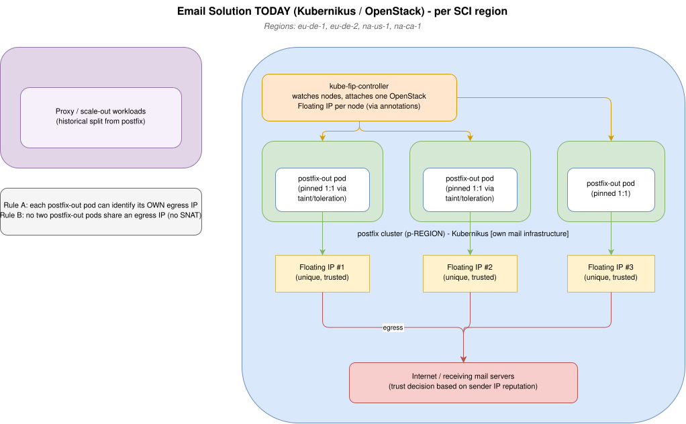

# Guidebook: Migrating the SAP Email Solution to Gardener (Sovereign Regions)

*Reference: Epic [#1293 — SCOS/FR Email solution deployment](https://github.wdf.sap.corp/cc/unified-kubernetes/issues/1293)*

---

## Part 1 — Introduction

### 1.1 What this is about

SAP runs an internal **email service** (codename **Cronus**). It does two jobs:

1. Acts as a **proxy to Amazon SES** (hands mail off to AWS to send).
2. Runs **SAP's own mail infrastructure** — actual postfix mail servers that send and receive email directly.

Job #2 is the hard part, and it's what this whole epic is about.

### 1.2 Why it can't stay where it is

The email service runs today on **Kubernikus** — an older Kubernetes platform sitting directly on SAP's OpenStack cloud. New regions are introducing **much stricter operational rules**:

| Region / Concept | The new rule |
|---|---|
| **eu-de-1** | Access requires **SÜ2 security clearance** (a German government-level vetting). |
| **French region** | Must be operated by **French citizens**, on French soil, fully isolated. |
| **SCOS** (Sovereign Cloud) | Everything stays **inside the region** — no reaching the public internet or other regions. |

Kubernikus can't meet these rules. The MK8s team's platform — **Gardener** — can. So the email team must migrate from Kubernikus to Gardener.

### 1.3 The one thing that makes this genuinely hard

When you send email, the receiving server decides "trust or spam?" largely based on **the IP address the mail came from**. A clean IP with good history gets delivered; a shared or unknown IP gets blocked. This is **IP-and-DNS-based reputation**.

The email team has spent years building trusted reputation on **specific IP addresses**. Their entire outbound design depends on two rules:

- **Rule A:** Each outbound mail server (`postfix-out` pod) must be able to **identify its own egress IP** (know its own "return address").
- **Rule B:** Two `postfix-out` pods must **never share** an egress IP.

Rule B is the killer, because the easy networking option on Gardener (**SNAT** — many pods hidden behind one shared IP) is exactly what Rule B forbids.

> **Analogy:** Picture a fleet of delivery trucks. Today each truck has **its own license plate**, and receivers recognize and trust those plates. On the new platform, the default is to force **all trucks to share one plate** — which destroys the trust they've built.

### 1.4 What the epic actually asks for *right now*

This is **not** "go build it yet." The epic defines three steps:

1. Email team collects their questions and notes *(done — see the epic comment).*
2. **MK8s digests the input and forms the MK8s view** on the topic.
3. MK8s sets up a call with the Email team to align on next steps.

So the immediate job is **analysis and a recommendation**, not construction.

---

## Part 2 — Diving into the details

### 2.1 How it works today (the "before" picture)

- **Two clusters per region** (a historical split):
  - `scaleout` cluster (named `s-REGION`)
  - `postfix` cluster (named `p-REGION`)
- Both run on **Kubernikus**.
- Live in **four SCI regions**: eu-de-1, eu-de-2, na-us-1, na-ca-1.
- The **own mail infrastructure** lives in the `postfix` cluster.
- **The unique-IP trick:**
  1. They run many **node pools of size 1** (one machine each).
  2. A helper called **`kube-fip-controller`** watches those machines and attaches an **OpenStack Floating IP** to each one (via annotations telling it which IP/network to use).
  3. Each `postfix-out` pod is **pinned 1:1** to its own machine using **taints & tolerations** (so it never moves and its IP never changes).

Result: one pod → one machine → one dedicated Floating IP. Rules A and B satisfied.



*Diagram source is editable: open `assets/epic-1293-before.drawio.svg` directly in draw.io (it is a `.drawio.svg` hybrid — a renderable image plus embedded editable source).*

#### 2.1.1 Verifying the "before" picture with the `u8s` CLI

`u8s` (Unified Kubernetes Toolbox) is an auth-managed wrapper — `u8s kubectl ...` is `kubectl ...` against the selected cluster. Target a cluster with `--context`. The email clusters are named exactly as described above:

| Purpose | Contexts |
|---|---|
| postfix (own mail infra) | `p-eu-de-1`, `p-eu-de-2`, `p-na-us-1`, `p-na-ca-1` |
| scaleout | `s-eu-de-1`, `s-eu-de-2`, `s-na-us-1`, `s-na-ca-1` |

All commands below are **read-only** and were run live against `p-eu-de-2` on 2026-07-22. Swap the context for other regions.

**Claim: two clusters per region (scaleout `s-`, postfix `p-`)**
```bash
u8s kubectl config get-contexts -o name | grep -E '^[sp]-'
```
Output:
```
p-eu-de-1
p-eu-de-2
p-na-ca-1
p-na-us-1
s-eu-de-1
s-eu-de-2
s-na-ca-1
s-na-us-1
```
**What it means:** exactly the split the epic describes — a postfix cluster (`p-`) and a scaleout cluster (`s-`) for each of the four SCI regions.

**Claim: own mail infra lives in the postfix cluster; the postfix-out workload exists**
```bash
# the postfix cluster's namespaces
u8s --context p-eu-de-2 kubectl get ns | grep -i postfix

# the postfix-out pods and which node each runs on (see the NODE column)
u8s --context p-eu-de-2 kubectl -n postfixout get pods -o wide
```
Output:
```
postfix-milter          Active   377d
postfix-observability   Active   20d
postfixin               Active   377d
postfixin-bounce        Active   377d
postfixout              Active   377d
postfixout-alt          Active   260d

NAME            READY   STATUS    RESTARTS   AGE     IP              NODE
postfix-out-0   4/4     Running   0          5d21h   100.100.16.22   kks-p-eu-de-2-postfixout-7-2fdbt
postfix-out-1   4/4     Running   0          5d23h   100.100.10.22   kks-p-eu-de-2-postfixout-2-kfq4s
postfix-out-2   4/4     Running   0          5d20h   100.100.19.21   kks-p-eu-de-2-postfixout-9-g2m2c
...
postfix-out-8   4/4     Running   0          5d22h   100.100.14.21   kks-p-eu-de-2-postfixout-5-2b4ks
```
**What it means:** the outbound mail servers are a StatefulSet named `postfix-out` in the `postfixout` namespace (`postfix-out-0` … `postfix-out-8`). Each pod lands on its **own dedicated node** (`kks-p-eu-de-2-postfixout-<N>-…`) — no two share a node. The `IP` column here is only the internal pod IP (100.100.x.x); the *egress* IP is the node's Floating IP, shown next.

**Claim: dedicated per-pod node pools with a Floating IP assigned by kube-fip-controller**
```bash
# nodes carrying the kube-fip-controller labels (each shows a distinct externalIP)
u8s --context p-eu-de-2 kubectl get nodes \
  -L kube-fip-controller.ccloud.sap.com/enabled \
  -L kube-fip-controller.ccloud.sap.com/externalIP

# confirm the controller itself is running (it lives in the `default` namespace)
u8s --context p-eu-de-2 kubectl get pods -A | grep -i fip
```
Output:
```
NAME                               STATUS   ...  ENABLED   EXTERNALIP
kks-p-eu-de-2-default-k84rg        Ready    ...
kks-p-eu-de-2-postfixout-1-rm45v   Ready    ...  true      130.214.145.194
kks-p-eu-de-2-postfixout-2-kfq4s   Ready    ...  true      130.214.145.195
kks-p-eu-de-2-postfixout-3-82ftq   Ready    ...  true      130.214.145.196
...
kks-p-eu-de-2-postfixout-9-g2m2c   Ready    ...  true      130.214.145.205
kks-p-eu-de-2-postfixout-alt-1-w4wkt Ready  ...  true      217.77.254.2

default   kube-fip-controller-5c56fdbc64-dhfgp   1/1   Running   0   6d2h
```
**What it means:** this is the heart of the "before" design. The `default-*` nodes carry no external IP. Every `postfixout-<N>` node is labelled `enabled=true` and stamped with a **unique public Floating IP** (130.214.145.194, .195, .196 …). The `kube-fip-controller` pod (running in `default`) is what assigns those IPs by talking to OpenStack. The `postfixout-alt-*` nodes are a second pool on a different IP range (217.77.254.x). This directly satisfies **Rule B** (no two pods share an egress IP).

**Claim: postfix-out pods are pinned 1:1 to those nodes (taint + nodeSelector)**
```bash
# the taint on a postfixout node
u8s --context p-eu-de-2 kubectl get node kks-p-eu-de-2-postfixout-1-rm45v \
  -o jsonpath='{.spec.taints}'

# a specific pod's node + how it is pinned (1:1 proof)
u8s --context p-eu-de-2 kubectl -n postfixout get pod postfix-out-5 -o json \
  | jq '{node: .spec.nodeName, tolerations: .spec.tolerations, nodeSelector: .spec.nodeSelector}'
```
Output:
```json
[{"effect":"NoSchedule","key":"dedicated","value":"postfixout"}]

{
  "node": "kks-p-eu-de-2-postfixout-1-rm45v",
  "tolerations": [
    {"effect":"NoSchedule","key":"dedicated","operator":"Equal","value":"postfixout"}
  ],
  "nodeSelector": { "postfixout": "true" }
}
```
**What it means — the taint + toleration + nodeSelector mechanism.** Pinning a pod to *exactly* the right node needs **two independent guarantees**, because a taint and a nodeSelector each solve only half the problem:

| Mechanism | Lives on | Question it answers | Direction of the fence |
|---|---|---|---|
| **Taint** `dedicated=postfixout:NoSchedule` | the **node** | "Who is allowed *onto* this node?" | Keeps *others out* |
| **Toleration** `dedicated=postfixout` | the **pod** | "Is this pod permitted past that taint?" | Grants *this pod entry* |
| **nodeSelector** `postfixout=true` | the **pod** | "Which nodes may this pod land on?" | Keeps *this pod in* |

Why all three are needed in our case:

1. **The taint alone** stops random workloads (monitoring, system pods, other teams' pods) from landing on a Floating-IP node and "stealing" a scarce, reputation-bearing IP. But a taint does **not** attract anything — it only repels.
2. **The toleration alone** would let a `postfix-out` pod *tolerate* the taint, but Kubernetes could still schedule it onto an ordinary `default-*` node (which has no Floating IP) — breaking Rule A. A toleration is *permission*, not *placement*.
3. **The nodeSelector** closes that gap: `postfixout=true` forces the pod onto a postfixout node and nowhere else.

So the taint fences everyone else **out**, and the nodeSelector fences the `postfix-out` pod **in** — the intersection is precisely the dedicated FIP nodes. Combined with the StatefulSet's **stable pod identity** (`postfix-out-3` is always `postfix-out-3`), each pod deterministically lands on its own dedicated node → keeps its own Floating IP across restarts → **Rules A and B hold**.

> This is exactly the behaviour that is hard to reproduce on Gardener: it depends on (a) freely creating one-node pools, (b) a controller that attaches an OpenStack Floating IP to each node, and (c) taint/selector scheduling to bind a specific pod to a specific IP-bearing node. See §2.3–2.4.

**Check all four postfix regions at once.** `foreach` needs the `kubectl` keyword *explicitly* — unlike `u8s kubectl`, the subcommand is not implied. Omitting it fails with `expected "kubectl" before "get"`. Add `-q` to skip the confirmation prompt:
```bash
u8s foreach -q -s 'name in (p-eu-de-1,p-eu-de-2,p-na-us-1,p-na-ca-1)' \
  kubectl get nodes -L kube-fip-controller.ccloud.sap.com/externalIP
```
Output (trimmed to the postfixout nodes per region):
```
[p-eu-de-1] kks-p-eu-de-1-postfixout-1-lmvtd       130.214.133.130
[p-eu-de-1] kks-p-eu-de-1-postfixout-alt-2-4vzsh   217.77.255.2
[p-eu-de-2] kks-p-eu-de-2-postfixout-1-rm45v       130.214.145.194
[p-eu-de-2] kks-p-eu-de-2-postfixout-alt-1-w4wkt   217.77.254.2
[p-na-us-1] kks-p-na-us-1-postfixout-1-6v2zc       130.214.178.195
[p-na-us-1] kks-p-na-us-1-postfixout-alt-2-rddgn   217.77.253.2
[p-na-ca-1] kks-p-na-ca-1-postfixout-1-rt79x       130.214.120.147
[p-na-ca-1] kks-p-na-ca-1-postfixout-alt-1-ndmgf   217.77.252.2
```
**What it means:** the same pattern holds in **all four regions** — a primary `postfixout` pool on a `130.214.x.x` range and an `alt` pool on a `217.77.x.x` range, each node with its own unique Floating IP. Every region carries its own distinct set of trusted IPs.

**The `postfixout-alt-*` nodes — a second, independent outbound pool.** The `alt` nodes are **not** spares or replicas of the main pool. They are a completely separate copy of the whole mechanism, verified live on `p-eu-de-2`:

```bash
# alt pods run their own StatefulSet in their own namespace
u8s --context p-eu-de-2 kubectl -n postfixout-alt get statefulset,pods -o wide

# an alt node's taint + the FIP-controller labels driving its IP
u8s --context p-eu-de-2 kubectl get node kks-p-eu-de-2-postfixout-alt-1-w4wkt \
  -o jsonpath='{.spec.taints}{"\n"}{.metadata.labels}'
```
Output (trimmed):
```
statefulset.apps/postfix-out-alt   2/2
postfix-out-alt-0   Running   kks-p-eu-de-2-postfixout-alt-1-w4wkt
postfix-out-alt-1   Running   kks-p-eu-de-2-postfixout-alt-2-2rsz2

[{"effect":"NoSchedule","key":"dedicated","value":"postfixout-alt"}]
"postfixout-alt":"true"
"kube-fip-controller.ccloud.sap.com/externalIP":"217.77.254.2"
"kube-fip-controller.ccloud.sap.com/floating-network-name":"FloatingIP-external-hcp03-SmtpMailBackend-01"
"kube-fip-controller.ccloud.sap.com/floating-subnet-name":"FloatingIP-internet-hcp03-SmtpMailBackend-01-03"
"kube-fip-controller.ccloud.sap.com/reuse-fips":"true"
```

Everything is a parallel, isolated twin of the main pool:

| Aspect | Primary pool | `alt` pool |
|---|---|---|
| Namespace | `postfixout` | `postfixout-alt` |
| StatefulSet | `postfix-out` (9 pods) | `postfix-out-alt` (2 pods) |
| Node taint / selector | `dedicated=postfixout` / `postfixout=true` | `dedicated=postfixout-alt` / `postfixout-alt=true` |
| Floating IP range | `130.214.x.x` | `217.77.x.x` |

Because it uses a **different taint value and a different selector key**, the alt pool is scheduled entirely independently — a `postfix-out` pod can never land on an alt node, and vice versa. And because it draws from a **different OpenStack floating network/subnet** (`217.77.x.x`, a distinct IP range and reputation identity), it gives the Email team a second, cleanly-separated set of trusted egress IPs. Typical uses for such a split: separating traffic classes (e.g. transactional vs. bulk), isolating a sender reputation so a problem on one range can't poison the other, or staged IP warm-up. The `reuse-fips=true` label tells `kube-fip-controller` to re-attach the *same* pre-existing Floating IPs when a node is recreated, so the hard-won reputation of a specific IP survives node churn.

> **Migration implication:** the target Gardener design must reproduce **N independent egress-IP pools**, not just one — each with its own stable, reputation-bearing IP range that survives node recreation. This multiplies the difficulty of the §2.4 egress-IP problem.

> **Notes:**
> - All names above are **live-verified** on `p-eu-de-2` (2026-07-22): namespaces `postfixout` / `postfixout-alt`, StatefulSets `postfix-out` (9) / `postfix-out-alt` (2), node labels `kube-fip-controller.ccloud.sap.com/{enabled,externalIP,floating-network-name,floating-subnet-name,reuse-fips}`, taints/selectors `dedicated=postfixout`+`postfixout=true` and `dedicated=postfixout-alt`+`postfixout-alt=true`, and `kube-fip-controller` running in the `default` namespace. The `foreach` run confirmed the same layout in all four regions (eu-de-1, eu-de-2, na-us-1, na-ca-1).
> - `u8s foreach` requires the explicit `kubectl` keyword before the args (`u8s foreach -s ... kubectl get ...`); omitting it errors with `expected "kubectl" before "get"`. The plain `u8s kubectl ...` form does imply nothing extra — only `foreach` has this requirement.
> - **eu-de-1 access may require SÜ2 clearance** (the very reason for this epic). If `p-eu-de-1` refuses auth, that is expected — `p-eu-de-2` is the safe one to inspect.

### 2.2 The target (the "after" picture)

- **One cluster per region** (merge the historical scaleout + postfix split).
- Running on **Gardener**.
- **No access to most OpenStack infrastructure** — this is the big loss, because that's exactly what `kube-fip-controller` depended on.

### 2.3 Why the old trick breaks on Gardener

`kube-fip-controller` talks **directly to OpenStack** (Neutron) to grab and attach Floating IPs. On the sovereign Gardener setup, the email team **won't have that OpenStack access**. So the mechanism that gave each pod its own IP is gone, and they need a replacement that still satisfies Rules A and B.

### 2.4 The candidate replacement approaches (to be evaluated, not yet chosen)

These are the options a technical spike would weigh:

1. **Run `kube-fip-controller` inside the Gardener cluster** — would need OpenStack credentials handed into the sovereign cluster. Likely **blocked by sovereignty rules**.
2. **Calico Egress Gateways** — Gardener's default networking (Calico) can route specific pods' outbound traffic through dedicated "gateway" machines. Pin gateways to specific machines → traffic exits via those machines' IPs. Promising, but must be checked against Rule B (no sharing) and "pod knows its own IP" (Rule A).
3. **Cloud-provider LoadBalancer / FIP-per-worker-node** — use Gardener's cloud controller to assign addresses at the node level.
4. **Any Gardener-native egress-IP primitive** — check whether the platform now offers something purpose-built.

Each must be scored on: *satisfies Rule A? satisfies Rule B? survives sovereignty rules? operable/monitorable?*

### 2.5 The secondary concerns

- **Inbound traffic** — receiving mail also has IP/DNS requirements, but "generally slightly relaxed" versions of the outbound ones (static ingress IP + reverse-DNS ownership).
- **Cluster consolidation** — merging two clusters into one means re-checking isolation, node pools, and the security guardrails (Gatekeeper rules today are keyed on `postfix`/`scaleout` cluster types).
- **Sovereignty plumbing** — all container images must come from the **in-region mirror** (`keppel.global.cloud.sap`), no cross-region calls, credentials stay local.
- **"Are there other showstoppers?"** — an explicit open question in the epic; expect surprises.

---

## Part 3 — The step-by-step guide (phased plan)

> Each step maps to a proposed work item under Epic #1293. **Discovery first, build last** — so the alignment call isn't blocked on building anything.

### Phase 0 — Discovery & Alignment

**Step 1 — Requirements & showstopper analysis.**
Go through the email team's requirements one by one. Classify each: *works natively on Gardener / needs effort / genuine showstopper.* Produce the showstopper list and flag which topics need a deep-dive spike.
→ *Unblocks the epic's "MK8s forms its view" step.*

**Step 2 — Spike: unique per-pod egress IP (THE critical one).**
Investigate the replacement options from §2.4. Produce a comparison matrix and a **recommended approach** with rejected options explained. This is a *decision* spike, not building.
→ *Everything downstream depends on this. Start it first.*

**Step 3 — Spike: inbound traffic.**
Work out how incoming mail gets its required static IP + reverse-DNS on Gardener under sovereignty rules.

**Step 4 — Spike: sovereignty & operational constraints.**
List the concrete SÜ2 / French-citizen / SCOS rules and identify which parts of today's email solution break them (external image pulls, cross-region calls, etc.).

**Step 5 — Spike: single-cluster consolidation.**
Design how the two clusters merge into one — node-pool isolation, taints/tolerations, updated security guardrails.

### Phase 1 — Design

**Step 6 — MK8s target architecture & migration design doc.**
Fold Steps 1–5 into one MK8s-view document: target design, migration path off Kubernikus, open risks, and the **agenda for the alignment call** with the email team.
→ *This is the concrete deliverable the epic is asking for.*

### Phase 2 — Implementation *(only after the direction is agreed)*

**Step 7 — Build the chosen egress/ingress IP solution.**
Implement whatever won Step 2/3, verify each `postfix-out` pod egresses on a **unique** IP and can read its own IP, in a non-prod Gardener cluster first.

**Step 8 — Adapt the Cronus/postfix Helm charts.**
Update the `openstack/cronus` chart and security guardrails for the single-cluster Gardener + sovereign setup (image mirroring, remove OpenStack-only assumptions, adjust tolerations/affinity).

**Step 9 — Observability, alerting & runbook.**
Add monitoring for the new IP mechanism (per-IP health, reputation-affecting failures), alerts, and a troubleshooting runbook. *(Postfix clusters currently lack the Prometheus operator — fix that too.)*

### Phase 3 — Rollout

**Step 10 — Per-region rollout + Kubernikus decommission.**
Roll out region by region, validate in-region (no IP-sharing regression, reputation intact), retire the old Kubernikus clusters, keep a rollback plan.

### Dependency map

```
Step1 ─┬─ Step2 ─┐
       ├─ Step3 ─┤
       ├─ Step5 ─┼─ Step6 ─┬─ Step7 ─┬─ Step9 ─┐
Step4 ─┴─────────┘         ├─ Step8 ─┴─────────┼─ Step10
                           └───────────────────┘
```

---

## Part 4 — Possible issues & risks

### 4.1 The showstopper-grade risks

| # | Risk | Why it matters | Mitigation |
|---|---|---|---|
| R1 | **No unique-egress-IP solution exists on Gardener** that satisfies both Rule A and Rule B without OpenStack access. | This alone could **block the entire migration**. | Front-load Step 2; if all options fail, escalate to a platform-feature request or a negotiated exception before committing to the move. |
| R2 | **SNAT forced by the platform** — the default sharing behavior. | Directly violates Rule B → **email reputation collapse** → mail marked as spam/blocked. | Explicitly reject any SNAT-based option in the spike; verify "no sharing" end-to-end before rollout. |
| R3 | **Sovereignty forbids handing OpenStack creds into the cluster.** | Kills the "just run kube-fip-controller on Gardener" shortcut. | Assume it's blocked; design around it (Step 4 confirms). |

### 4.2 Reputation & DNS risks

| # | Risk | Why it matters | Mitigation |
|---|---|---|---|
| R4 | **Losing the existing trusted IPs** during migration. | Years of built-up reputation could be lost if new IPs are used. | Plan to **carry over the same IPs** if possible; warm up new IPs gradually if not. |
| R5 | **Reverse-DNS (PTR) ownership** in the new sovereign region. | Mail servers need matching forward+reverse DNS or receivers distrust them. | Confirm who controls PTR records in-region (Step 3/4). |
| R6 | **Pod's egress IP not self-identifiable** (Rule A) even if uniqueness works. | Postfix needs to *know* its own outward IP to behave correctly. | Make "pod can read its own egress IP" a hard acceptance criterion in Step 2 & 7. |

### 4.3 Platform & consolidation risks

| # | Risk | Why it matters | Mitigation |
|---|---|---|---|
| R7 | **Merging two clusters into one** breaks isolation assumptions. | Security guardrails (Gatekeeper) are keyed on the old `postfix`/`scaleout` split. | Redesign isolation via node pools + network policy (Step 5); update Gatekeeper rules (Step 8). |
| R8 | **Images/dependencies not mirrored** into the sovereign registry. | Sovereign regions can't pull from the public internet → deploy fails. | Inventory every image/dependency (Step 4); mirror to `keppel.global.cloud.sap`. |
| R9 | **No monitoring for the new IP mechanism**, and postfix clusters lack Prometheus operator today. | A silently-broken egress IP = silent reputation damage. | Build alerting/dashboards in Step 9 as part of Definition of Done. |
| R10 | **Overlap/conflict with the Kubernikus-migration initiative** already underway. | Duplicated or contradictory work. | Coordinate with the named contacts (@d062284, @c5267192, @D074427) during Step 1. |

### 4.4 Process risks

| # | Risk | Why it matters | Mitigation |
|---|---|---|---|
| R11 | **Unknown unknowns** — the epic literally asks "are there other showstoppers?" | Hidden requirements surface late and derail rollout. | Treat spikes as genuine investigations; keep the alignment call (Step 6) as a checkpoint to surface gaps. |
| R12 | **Building before aligning.** | Wasted effort if the email team disagrees with the chosen direction. | Enforce the phase gate: **no Phase 2 work until Step 6's design is agreed on the call.** |

---

## Appendix A — Issue templates (ready to paste under Epic #1293)

Two work items decompose the plan. Both are intended as **sub-issues of [#1293](https://github.wdf.sap.corp/cc/unified-kubernetes/issues/1293)** in `cc/unified-kubernetes`. The structure follows the house format from #1301 (Summary / Reason / Scope / Acceptance Criteria / Definition of Done / References). Copy the block verbatim into a new issue.

---

### Issue 1 — Discovery, spikes & design

```markdown
### Summary

Investigate whether the Email solution (Cronus / postfix) can move from Kubernikus to
Gardener-based MK8s for the SCOS/FR sovereign regions, and produce the MK8s-view target
architecture + migration design. This covers all discovery and design work up to (and
including) the alignment-call artifact — no implementation.

Revives the intent of #1301 (closed as not_planned) as an actionable set of spikes.

### Reason

The Email team hosts its own outbound mail infrastructure and depends on each `postfix-out`
pod having a unique, self-identifiable egress IP (email reputation is IP/DNS based). Today
this is achieved on Kubernikus/OpenStack via `kube-fip-controller` + size-1 node pools +
taint/selector pinning. New regions (eu-de-1 SÜ2 clearance, French-citizen-operated, SCOS)
require Gardener, where most OpenStack infrastructure is unavailable. MK8s must form its view
and align with the Email team on next steps (per Epic #1293).

### Hard requirements to preserve (from the Email team)

The migration must keep both of these true — they are the make-or-break constraints:

- **Rule A — self-identifiable egress IP:** each `postfix-out` pod must be able to identify
  its **own** egress (outbound) IP address.
- **Rule B — no shared egress IP:** two `postfix-out` pods must **never** share an egress IP.
  This rules out most SNAT-based options (many pods behind one IP).

Why: outbound email reputation is largely IP- and DNS-based; a shared or unidentifiable IP
degrades deliverability. Inbound traffic has similar but slightly relaxed requirements.

### Scope (Steps 1–6)

- [ ] **Step 1 — Requirements & showstopper analysis.** Classify every requirement in the
      [Email team comment](https://github.wdf.sap.corp/cc/unified-kubernetes/issues/1293#issuecomment-18203637)
      as native / needs-effort / showstopper; flag which need a spike.
- [ ] **Step 2 — Spike: unique per-pod egress IP (critical path).** Evaluate options
      (kube-fip-controller-in-shoot, Calico Egress Gateways, LB/FIP-per-node, Gardener-native)
      against: satisfies Rule A (pod identifies own IP), Rule B (no shared IP / no SNAT),
      sovereignty-compatible, operable. Must reproduce **N independent egress-IP pools**
      (primary + `alt`), each stable across node recreation. Deliver a comparison matrix +
      recommendation + rejected-with-reason list.
- [ ] **Step 3 — Spike: inbound traffic.** Static ingress IP + reverse-DNS ownership on
      Gardener under sovereignty.
- [ ] **Step 4 — Spike: sovereignty & operational constraints.** SÜ2 / French-citizen / SCOS
      rules; inventory email-solution artifacts that violate them (external image pulls,
      cross-region deps); registry mirroring to `keppel.global.cloud.sap`.
- [ ] **Step 5 — Spike: single-cluster consolidation.** Merge `scaleout` + `postfix` into one
      Gardener cluster: node-pool isolation, taints/selectors, Gatekeeper `cluster_type` impact.
- [ ] **Step 6 — MK8s target architecture & migration design doc.** Consolidate Steps 1–5 into
      one design: target topology, egress/ingress IP solution, migration path off Kubernikus,
      risks, and the agenda for the Email-team alignment call.

### Acceptance Criteria

- [ ] Every requirement classified; showstoppers explicitly identified (or "none found").
- [ ] Recommended egress-IP approach chosen with a documented comparison and rejected options.
- [ ] Inbound + sovereignty + consolidation spikes each produce a written finding.
- [ ] A single MK8s-view design doc exists and is ready to drive the alignment call.
- [ ] Overlap with the Kubernikus-migration initiative is noted (contacts below).
- [ ] Follow-up implementation issue (Issue 2) is refined/updated based on the chosen direction.

### Definition of Done

- [ ] Spikes are decision spikes only — no production changes made.
- [ ] Design doc reviewed by MK8s and shared with the Email team.
- [ ] Alignment call scheduled/held; agreed next steps recorded on Epic #1293.
- [ ] Unit/integration tests: N/A (investigation only — state explicitly).

### References

- Epic: #1293 — https://github.wdf.sap.corp/cc/unified-kubernetes/issues/1293
- Email team requirements (comment): https://github.wdf.sap.corp/cc/unified-kubernetes/issues/1293#issuecomment-18203637
- Prior evaluation ticket (closed, not_planned): #1301 — https://github.wdf.sap.corp/cc/unified-kubernetes/issues/1301
- Current FIP mechanism (Helm chart): `system/kube-fip-controller` — https://github.com/sapcc/kubernetes-operators/tree/master/kube-fip-controller
- Email service chart: `openstack/cronus` — https://github.com/sapcc/helm-charts/tree/master/openstack/cronus
- Gatekeeper postfix/scaleout rules: `system/gatekeeper/templates/constraint-pod-security-v2.yaml`
- Example of current FIP node annotations (cronus-terraform): https://github.wdf.sap.corp/cronus/cronus-terraform/blob/3120c214cb4170cf384e912f2b704337233bcc11/sci/p-eu-de-1/main.tf#L133
- Sovereign registry mirror: `keppel.global.cloud.sap`
- Contacts: @d062284 @c5267192 @D074427 (Email/MK8s), @I776887 @I769575 (epic authors)
```

---

### Issue 2 — Implementation & rollout

> **Blocked by Issue 1.** Do not start until the Step 6 design is agreed on the alignment call
> (phase gate R12).

```markdown
### Summary

Implement the agreed Gardener target design for the Email solution and roll it out to the
SCOS/FR sovereign regions, then decommission the old Kubernikus scaleout/postfix clusters.

### Reason

Follows the discovery + design work in Issue 1. Once the egress-IP approach and target
architecture are agreed with the Email team, MK8s + Email build, validate, and migrate the
solution region by region under the new sovereign operational rules.

### Scope (Steps 7–10)

- [ ] **Step 7 — Build the chosen egress/ingress IP solution.** Implement the approach selected
      in Issue 1 (e.g. Calico Egress Gateway + dedicated node pool, or CCM-based FIP wiring).
      Reproduce all independent egress-IP pools (primary + `alt`). Verify in a non-prod Gardener
      shoot that each `postfix-out` pod egresses on a **unique** IP and can read its own IP.
- [ ] **Step 8 — Adapt Cronus/postfix Helm charts.** Update `openstack/cronus` + Gatekeeper
      constraints for the single-cluster Gardener + sovereign target: image mirroring to
      `keppel.global.cloud.sap`, remove OpenStack-only assumptions, `sovereignCloud.enabled`
      path, adjusted tolerations/affinity/node pools, updated `cluster_type` rules.
- [ ] **Step 9 — Observability, alerting & runbook.** Monitoring for the new egress-IP mechanism
      (per-IP health, reputation-affecting failures), alerts, troubleshooting runbook. Add the
      Prometheus operator to postfix clusters (currently absent).
- [ ] **Step 10 — Per-region rollout + Kubernikus decommission.** Staged rollout to target
      regions with in-region validation (no IP-sharing regression, reputation intact), then
      retire the old Kubernikus scaleout/postfix clusters. Keep a rollback plan.

### Acceptance Criteria

- [ ] Each `postfix-out` pod egresses on a unique IP and can identify its own IP (Rules A & B),
      verified end-to-end.
- [ ] All independent egress-IP pools (primary + `alt`) reproduced; IPs stable across node churn.
- [ ] Charts render and deploy on Gardener; sovereignty checklist from Issue 1 (Step 4) passes.
- [ ] Alerts + dashboards + runbook in place; Prometheus operator present on postfix clusters.
- [ ] Solution live on Gardener in each target region; old Kubernikus clusters decommissioned.

### Definition of Done

- [ ] Provide unit and integration tests. Explain if not applicable.
- [ ] Documentation is up-to-date.
- [ ] Verify the solution works in QA.
- [ ] Contributions don't decrease code coverage (or explain why).
- [ ] Provide alerts and troubleshooting guide.
- [ ] Rollout to production executed; rollback plan documented.

### References

- Epic: #1293 — https://github.wdf.sap.corp/cc/unified-kubernetes/issues/1293
- Email team requirements (comment): https://github.wdf.sap.corp/cc/unified-kubernetes/issues/1293#issuecomment-18203637
- Discovery + design work item: Issue 1 (link once created)
- Prior evaluation ticket (closed, not_planned): #1301 — https://github.wdf.sap.corp/cc/unified-kubernetes/issues/1301
- Current FIP mechanism (Helm chart): `system/kube-fip-controller` — https://github.com/sapcc/kubernetes-operators/tree/master/kube-fip-controller
- Email service chart: `openstack/cronus` — https://github.com/sapcc/helm-charts/tree/master/openstack/cronus
- Gatekeeper postfix/scaleout rules: `system/gatekeeper/templates/constraint-pod-security-v2.yaml`
- Example of current FIP node annotations (cronus-terraform): https://github.wdf.sap.corp/cronus/cronus-terraform/blob/3120c214cb4170cf384e912f2b704337233bcc11/sci/p-eu-de-1/main.tf#L133
- Sovereign registry mirror: `keppel.global.cloud.sap`
- Contacts: @d062284 @c5267192 @D074427 (Email/MK8s), @I776887 @I769575 (epic authors)
```

---

## Appendix B — Reference material

- **Epic:** [#1293 — SCOS/FR Email solution deployment](https://github.wdf.sap.corp/cc/unified-kubernetes/issues/1293)
- **Email team requirements comment:** [#1293 (comment)](https://github.wdf.sap.corp/cc/unified-kubernetes/issues/1293#issuecomment-18203637)
- **Prior (closed) evaluation ticket:** [#1301 — Email solution on Gardener requirements evaluation](https://github.wdf.sap.corp/cc/unified-kubernetes/issues/1301) *(closed as `not_planned`, converted to a grooming activity)*
- **Contacts:** @d062284, @c5267192, @D074427 (Email/MK8s); @I776887, @I769575 (epic authors)
- **Current FIP mechanism:** `system/kube-fip-controller` (Helm chart) → [sapcc/kube-fip-controller](https://github.com/sapcc/kubernetes-operators/tree/master/kube-fip-controller)
- **Email service chart:** `openstack/cronus` → [sapcc/helm-charts/openstack/cronus](https://github.com/sapcc/helm-charts/tree/master/openstack/cronus)
- **Gatekeeper postfix/scaleout rules:** `system/gatekeeper/templates/constraint-pod-security-v2.yaml`
- **Example FIP node annotations (cronus-terraform):** [`sci/p-eu-de-1/main.tf#L133`](https://github.wdf.sap.corp/cronus/cronus-terraform/blob/3120c214cb4170cf384e912f2b704337233bcc11/sci/p-eu-de-1/main.tf#L133)
- **Sovereign registry mirror:** `keppel.global.cloud.sap`
- **Embedded architecture diagram (editable source):** [`docs/assets/epic-1293-before.drawio.svg`](assets/epic-1293-before.drawio.svg)
